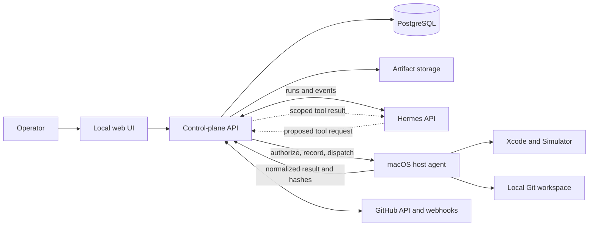

# MVP Engineering Specification

## Decision summary

Build the MVP as a **local web application plus a macOS host agent**.

- The **web app** is the Codex-like chat and task cockpit. It runs locally in a
  browser during the MVP and can later be hosted for a team.
- The **macOS host agent** runs on the developer's Mac and owns Xcode, the iOS
  Simulator, code-signing access, project workspaces, and local artifacts.
- **Hermes** is an external agent runtime reached through its API; it is not the
  database or workflow authority.

Do **not** start with Electron. Electron adds a desktop distribution and update
surface without solving the difficult parts: durable workflow state, live task
evidence, Xcode execution, or GitHub automation. A browser UI is faster to
iterate on and naturally supports the information-dense task cockpit.

Do **not** start with a native macOS app either. The host agent must be native
to macOS because it executes Apple tooling, but the operator UI does not. If a
desktop shell becomes valuable after the MVP, package the same web UI with
**Tauri**, not Electron, for a smaller footprint and native menu-bar, keychain,
and notification integration.

## MVP outcome

For one configured iOS repository, a user can submit a natural-language bug or
feature request and obtain a verified draft pull request.

The system supports this exact loop:

1. Create a task from chat.
2. Generate a structured brief and test plan, then either record an
   unambiguous policy bypass or obtain human approval.
3. Accept in-scope chat steering as a new, auditable brief version and cancel
   safely when the user asks.
4. Run Hermes to implement the scoped change in an isolated workspace through
   control-plane-mediated host tools.
5. Commit the candidate with a configured identity and run required project
   tests plus one configured simulator end-to-end flow against that exact SHA.
6. Persist redacted logs, test output, and a typed,
   criterion-by-criterion evidence report.
7. Make at most a configured number of repair attempts, then enter a resumable
   escalation or an explicit terminal outcome.
8. Push only the verified SHA and open a draft GitHub pull request whose head
   is proven to be that SHA.
9. Ingest correlated CI and review updates and show them in the task cockpit.
10. Make review repairs automatically only when a versioned policy has
    preapproved a low-risk, in-scope action; otherwise require human approval.
11. Hand the verified PR to a human to mark ready and merge. The system never
    merges or performs a production release.

## Explicit non-goals

- Multiple repositories or concurrent tenant support.
- Automatic merges or production release actions.
- Physical-device farms, broad signing automation, or production credentials.
- A generalized self-modifying policy system.
- Direct reuse of Pine's financial-domain schema.
- A distributed workflow engine or cloud deployment before the local loop works.

## System architecture



### Control-plane API

The control plane is the system of record. It creates tasks, moves task states,
enforces retry and approval policies, issues role-specific Hermes instructions,
records evidence, and handles GitHub webhook events.

It must never infer gate satisfaction from an agent's final prose. Advancing
past validation requires stored evidence that satisfies the active validation
contract. It is also the only tool broker: a Hermes tool request is checked
against task state, accepted brief, repository configuration, policy version,
and host-operation allowlist before the control plane records and dispatches
it.

### macOS host agent

The host agent is a small local service installed per developer machine. It
exposes a narrowly scoped API to the control plane for:

- creating and removing task workspaces;
- executing allowlisted project commands;
- selecting/booting a configured simulator;
- building and testing with configured Xcode schemes;
- collecting app, crash, and test logs;
- storing artifacts and returning content hashes and references; and
- creating branches and commits, validating clean Git state, and pushing the
  one configured task branch with control-plane-issued credentials.

It must not expose a generic shell endpoint. Commands are named operations with
validated arguments and project allowlists. Hermes has no direct network path
or credential to the host agent; all requests and results pass through the
control plane.

### Hermes adapter

The adapter starts and observes Hermes runs, maps Hermes events into task events,
and forwards only the tool capabilities appropriate to the current task state.
Hermes may propose actions, fixes, summaries, and rule candidates; it cannot
advance workflow state, call the host directly, approve itself, commit, push, or
declare a validation pass.

### GitHub adapter

The GitHub adapter opens draft pull requests, fetches check and review state,
and verifies webhook signatures. Webhooks wake the appropriate task rather than
allowing the agent to poll indefinitely.

## Recommended technology choices

| Concern | MVP choice | Reason |
| --- | --- | --- |
| Task cockpit | Next.js, React, TypeScript | Fast chat/dashboard iteration and strong streaming UI support. |
| API/control plane | FastAPI, Python | Natural fit for Hermes integration and iOS automation tooling. |
| Durable state | PostgreSQL | Reliable transactions, audit queries, and future multi-user path. |
| Background work | PostgreSQL-backed worker loop | Simple durable jobs; defer Temporal or another orchestrator. |
| Live updates | Server-Sent Events | One-way task-event stream is simpler than WebSockets for the MVP. |
| Host execution | Python macOS service managed by launchd | Native access to Xcode, Simulator, Git, and local artifacts. |
| Artifact storage | Local filesystem with content-addressed paths | Easy local evidence capture; abstract behind an interface for later object storage. |
| GitHub | GitHub App | Narrow, revocable permissions and signed webhooks. |
| Desktop packaging | None initially; Tauri later if needed | Browser first; package only after workflow value is proven. |

## Task state model

```text
INTAKE -> BRIEFING
BRIEFING -> IMPLEMENTING                         (recorded policy bypass)
BRIEFING -> BRIEF_PENDING_APPROVAL
BRIEF_PENDING_APPROVAL -> BRIEFING               (human requests revision)
BRIEF_PENDING_APPROVAL -> IMPLEMENTING           (human approves exact version)
IMPLEMENTING -> VALIDATING
VALIDATING -> REPAIRING -> VALIDATING
VALIDATING -> PR_ACTIVE
PR_ACTIVE -> REPAIRING -> VALIDATING -> PR_ACTIVE
PR_ACTIVE -> READY_FOR_HUMAN_MERGE -> HANDED_OFF
READY_FOR_HUMAN_MERGE -> PR_ACTIVE               (readiness gate invalidated)

Any active state -> ESCALATED
ESCALATED -> prior recorded state                     (decision + recheck)
Any non-terminal state -> CANCELLED
Any active or escalated state -> FAILED
Any pre-handoff active state -> BRIEFING         (scope-affecting steering)
```

State transitions are executed only by the control plane. Each transition stores
the actor, cause, timestamp, policy version, and evidence references.

`BRIEFING` is active work that converts the raw request and later steering
messages into a versioned brief, typed acceptance criteria, risks, affected
flow, and validation plan. A versioned `BriefApprovalPolicy` makes exactly one
of two decisions:

- `AUTO_ACCEPTED_BY_POLICY` is allowed only when every required brief field is
  complete, no ambiguity or scope-expansion flag remains, the change avoids
  sensitive/prohibited paths, and all requested operations are already
  allowlisted and low risk. The inputs, policy version, and reason are recorded.
- `HUMAN_APPROVAL_REQUIRED` moves the task to `BRIEF_PENDING_APPROVAL`. Only a
  human approval of that exact brief version permits implementation. Revision
  returns to `BRIEFING`; rejection cancels the task unless the user supplies a
  replacement request.

`PR_ACTIVE` means a verified draft PR exists and GitHub updates are being
observed; it is the product outcome promised by this MVP, not a claim that the
work is merged or released. `READY_FOR_HUMAN_MERGE` means the exact current PR
head still has a passing validation run, required CI is green, no blocking
review remains, and every repair and rule decision has the required authority.
The system leaves the PR as a draft unless a human changes it. `HANDED_OFF`
means the human acknowledged responsibility for marking it ready and merging;
it is terminal for autonomous work and does not mean merged, deployed, or
released.

`ESCALATED` is a resumable pause, not a terminal synonym for failure. It stores
the blocked operation, prior/resume state, smallest required decision, retry
history, and evidence. An approving or corrective human decision creates an
audit event and resumes only at the stored state after preconditions are
rechecked. `FAILED` is terminal for an unrecoverable error or an explicitly
abandoned retry budget; `CANCELLED` is terminal for a user/policy cancellation.
Neither can be resumed in place: a new task must cite the terminal task.
Scope-affecting steering first cancels/fences in-flight work, invalidates prior
brief/contract and validation decisions, and then re-enters `BRIEFING`. If CI,
review, or head correlation ceases to satisfy readiness before handoff, the
control plane returns the task to `PR_ACTIVE` and records the invalidated gate.

### Task capability gates

- **Implementation gate:** the exact brief version has either human approval or
  a recorded policy bypass, the repository configuration is valid, and no
  approval is outstanding.
- **Mutation gate:** local authentication succeeded; the host lease is valid;
  minimal evidence, redaction, access, and deletion controls are active; and
  the requested operation is allowlisted for the current state.
- **Draft-PR gate:** a clean task branch is at commit `C`; the active
  `ValidationContract` passes for `C`; required artifacts are present; the
  pushed remote branch and GitHub PR head both resolve to `C`; and there is no
  unresolved approval or cancellation.
- **Human-merge-readiness gate:** the draft-PR gate still holds for the current
  head, required CI/checks pass, blocking reviews are resolved, and any review
  repair was authorized by the active review policy or a human.
- **Release-action gate:** always closed in the MVP. No token or host operation
  may merge, tag a release, deploy, or use production signing credentials.

## Core data model

### Task

`id`, repository, base revision, requester, raw request, state, accepted brief,
brief approval disposition, validation contract version, retry count,
escalation resume state, terminal outcome, created/updated timestamps.

### Brief and BriefApprovalDecision

An immutable brief version stores scope, exclusions, typed acceptance criteria,
risks, affected flow, and test plan. Its decision stores the exact brief
version, `AUTO_ACCEPTED_BY_POLICY` or `HUMAN_APPROVAL_REQUIRED`, evaluator/actor,
policy version, reason/ambiguity flags, time, and any human response.

### RepositoryConfiguration

Versioned non-secret repository, Git identity/remote, Xcode/simulator,
operation, E2E/assertion, artifact, and prohibited-path settings plus opaque
secret references and read-only preflight evidence. Tasks bind to one version.

### TaskEvent

Append-only event stream for user messages, agent progress, state transitions,
approvals, webhook notifications, and errors. The UI renders this as the live
activity feed.

### EvidenceRecord

Immutable reference to a canonical, redacted source artifact or payload. Store
type, origin, content hash, capture time, task/run relationship, access
classification, and retention policy. Corrections create a new record; they
never overwrite one. Sensitive values are redacted before canonical content is
persisted. Authorized deletion erases the content blob while retaining a
minimal tombstone, deletion actor/reason, and non-sensitive lineage metadata.

### ValidationContract

Versioned contract bound to a brief and repository-configuration version. Store
required build/test operations, simulator and clean-state setup, the one
configured E2E flow, task-specific typed assertions, evidence requirements,
timeouts, and pass/block/escalation rules. A `ValidationRun` cites both the
contract version and exact Git commit/tree it evaluated.

### ValidationRun

Configured test plan, command/operation result, simulator target, pass/fail
result, duration, log evidence, exact commit and tree SHA, and typed
acceptance-criterion results.

### ApprovalRequest

Reason, options, supporting evidence, requesting state, expiration, and human
decision. Examples: brief approval, unsafe action, repeated validation failure,
review conflict, and proposed rule.

### RuleCandidate

Proposed rule text, cited evidence records, recurrence/severity assessment,
false-positive risks, evaluation result, and status. It is not executable policy
until a human approval creates a versioned rule.

### ReviewRule and PolicyVersion

An approved `ReviewRule` stores scope, matcher, permitted action, risk class,
evidence requirements, provenance, approver, and active version. A
`PolicyVersion` is the immutable ordered set of active review rules and
workflow thresholds plus promoted prompt-version references used for a
decision. Rule candidates and draft prompt text are never executable records.

### BackgroundJobLease and WebhookDelivery

A job lease stores owner, attempt, fencing token, heartbeat/expiry,
idempotency key, checkpoint, and cancellation status. A webhook delivery stores
provider delivery ID, verified installation/repository/PR/head identifiers,
signature result, payload evidence, processing result, and quarantine reason.

## Prompt compiler

Store structured prompts as versioned templates. The compiler receives the
current task, accepted brief, repository configuration, active review rules,
and relevant verified evidence. It produces separate instructions for:

- planner;
- implementer;
- validator;
- pull-request writer; and
- reviewer/comment resolver.

Prompts must reference evidence by identifiers and summaries, not paste large
unbounded logs. Prompt changes are evaluated against saved representative tasks
before becoming the default. A prompt version may be used experimentally by an
explicit evaluation run, but promotion to the default requires a recorded
evaluation threshold pass, regression review, and human approval. Promotion is
an atomic `PolicyVersion` update with approver, evaluation evidence, and
rollback target; Hermes cannot promote a prompt.

## iOS integration contract

The repository configuration supplies:

- allowed repository root and default base branch;
- deterministic task-branch naming, remote name, and configured Git
  author/committer identity;
- Xcode workspace/project and production-like scheme;
- approved simulator runtime and device;
- build, unit-test, and integration-test operations;
- one deterministic end-to-end user flow with explicit success assertions;
- expected log/network signals and known acceptable warnings;
- artifact collection locations; and
- prohibited commands, files, and release-sensitive paths.

The initial E2E flow should be deliberately narrow and stable. It may use a
test account and deterministic fixtures, but must start at the real entry point
and demonstrate the changed user outcome. The MVP supports exactly one
repository-wide E2E flow; it is not a general UI-test authoring system. Each
task adds typed, machine-evaluable assertions tied to its acceptance criteria,
using a bounded initial vocabulary such as element/value present, navigation
state reached, expected network response observed, expected log event observed,
and no crash. Every assertion result cites direct evidence; free-form agent
prose cannot satisfy it.

### Git identity and exact-head binding

The host agent, never Hermes, owns Git branch, commit, and push operations:

1. Resolve the configured base ref once to immutable base SHA `B`, create the
   unique task branch/workspace from `B`, and record both.
2. Apply scoped file changes through mediated tools. The host refuses paths
   outside the owned workspace and repository policy.
3. Create candidate commit `C` using the configured author and committer name
   and email; record the identity and commit/tree SHAs. Credentials stay in the
   control plane/host and are never exposed to prompts.
4. Run the active `ValidationContract` against clean `HEAD == C`. Any content,
   configuration, contract, or commit change invalidates the pass and requires
   a new run.
5. After a pass, verify the worktree/index are clean and still at `C`, push the
   task branch without force, create/update the draft PR, and query GitHub to
   prove `pull_request.head.sha == remote_branch_sha == C`.

The proof is stored as evidence before entering `PR_ACTIVE`. A review repair
creates a new candidate commit and repeats the full binding; validation from a
previous head never carries forward.

## Evidence and continual learning

Separate four planes:

1. **Source records:** canonical, redacted accepted requests and approval
   dispositions, repository state, command output, test artifacts, review
   comments, and CI results. These are authoritative and append-only.
2. **Derived knowledge:** summaries, incident patterns, and rule candidates.
   These are non-authoritative, versioned, and cite exact source records.
3. **Retrieval index:** chunks and embeddings built only from verified records.
   The index is rebuildable and never authoritative.
4. **Evaluation and approval:** checks citation accuracy, freshness, access
   boundaries, task outcomes, token cost, and review noise before promotion.

For token efficiency, retrieval starts with narrow, filtered, compact summaries
and expands to source evidence only when uncertainty or decision impact requires
it. Persist retrieval set, source hashes, prompt/model version, token cost, and
quality outcome. Mutable working notes cannot become evidence or policy without
being captured as a new source record.

The minimal evidence foundation is a prerequisite to any autonomous repository
mutation. Every source payload first passes deterministic secret/PII redaction,
then receives a canonical envelope containing task, actor, origin, timestamps,
content hash, parent/correlation IDs, access class, and retention class. Reads
and downloads enforce the local user's session and record an access event.
Deletion is explicit: destroy the content and retrieval chunks, then append a
tombstone so the audit trail can explain the gap without retaining deleted
content. Derived summaries are deleted or rebuilt when a source is deleted.
The later retrieval/learning milestone builds on this envelope; it does not
introduce a second evidence format.

## Review-resolution authority

The MVP supports one review-resolution cycle. The control plane may authorize
an automatic repair only if an active, human-approved `ReviewRule` classifies
the requested edit as low risk, within the exact accepted brief and configured
paths, free of dependency/schema/signing/security changes, and within the
remaining repair budget. It records the matched rule and evidence before
mutation, then commits and reruns the entire active validation contract.

Unmatched, ambiguous, conflicting, speculative, scope-expanding, or higher-risk
feedback creates an `ApprovalRequest` with a proposed diff/plan. Silence,
agent confidence, or a prior similar comment is not approval. A human-approved
one-off repair grants authority only to that bounded change; making the pattern
reusable requires separate approval of a new `ReviewRule`.

## Reliability and operational semantics

- **Durable leases:** each job has a single owner, lease expiry, heartbeat, and
  attempt/fencing token. Only the current token may append an effect or advance
  state. After expiry, a new worker replays from the last durable checkpoint;
  named host and GitHub operations use idempotency keys.
- **Outages:** host, Hermes, and GitHub failures use bounded exponential retry
  with jitter. A short outage leaves the state unchanged and schedules another
  attempt. Exhaustion enters `ESCALATED` with service, last successful
  checkpoint, retry history, and a retry/cancel decision. It never becomes a
  validation pass or terminal success.
- **Cancellation:** cancellation is a durable control-plane event that revokes
  the job lease and Hermes tool grants. Workers check it before and after every
  external effect; the host terminates the owned process group, returns partial
  logs, and performs idempotent workspace cleanup only when policy permits.
  Late results are stored as ignored evidence and cannot change state.
- **Webhook correlation:** verify the signature, persist GitHub delivery ID and
  canonical payload before processing, and deduplicate by delivery ID. Correlate
  using GitHub App installation, repository ID, PR number, task branch, and head
  SHA—not branch text alone. Stale/out-of-order events remain audit evidence but
  cannot regress the current head or gate. Unknown or ambiguous events are
  quarantined for human inspection.
- **Restart recovery:** on startup, reconcile expired leases, in-flight Hermes
  runs, owned host processes, remote branch SHA, PR head SHA, and webhook
  cursor before issuing new effects.

## Security and approvals

- Use a GitHub App with repository-scoped, least-privilege permissions.
- Keep API keys and signing credentials in macOS Keychain or a dedicated secret
  store; never send them to Hermes prompts or artifacts.
- Verify GitHub webhook signatures and protect UI/API sessions with local user
  authentication.
- Bind the host agent to loopback or mutually authenticated local networking.
- Permit only configured operations and roots; deny arbitrary shell access.
- Require approval for scope expansion, unsafe configuration changes, repeated
  failures, and new review rules.
- Require an active local user session, CSRF protection, secure session cookies,
  and reauthentication for secrets, repository-policy changes, and terminal
  task actions. Loopback binding alone is not authentication.
- Do not give the GitHub App merge, release, or unrelated-repository
  permissions.
- Retain a task audit trail even if Hermes session history is compacted or
  removed.

## User interface requirements

### Chat

Create and steer tasks, show the accepted brief and its approval disposition,
and surface questions needing a decision. Chat messages link to the
corresponding task and evidence. Steering that changes acceptance criteria,
files, risk, or validation creates a new brief/contract version and re-enters
`BRIEFING`; it cannot silently widen an active run. Cancellation is an explicit
audited control.

### Task cockpit

Show a persistent stage timeline, readable activity feed, acceptance-criterion
checklist, prominent approval/blocker queue, and focused tabs for diff, test
artifacts, app/network logs, pull request/CI, and Rule Inbox. Full redacted logs
are collapsed by default but retain authorized search and download access.

### First screens

1. Local sign-in/session setup.
2. Task list and creation.
3. Task cockpit with chat steering.
4. Approval Inbox.
5. Rule Inbox.
6. Repository configuration and read-only preflight.

## Delivery plan

### Milestone 1: local control plane

Create local authentication, the database schema, explicit task state machine,
event stream, chat/task and repository-configuration UI, host leases, and the
minimal immutable/redacted/access-controlled/deletable evidence envelope. Prove
restart and cancellation behavior. No agent mutation is permitted until this
milestone passes.

### Milestone 2: Hermes implementation run

Integrate Hermes run start/stream/cancel; persist events; create a workspace;
mediate every tool request through the control plane; apply a scoped change;
commit with configured identity; and render the diff and candidate evidence.

### Milestone 3: validation and repair

Implement host-agent Xcode operations, one simulator E2E flow, artifact capture,
task-specific typed assertion evaluation, exact-commit binding, bounded repair,
resumable escalation, and explicit failure/cancellation.

### Milestone 4: GitHub loop

Open a draft PR, ingest signed GitHub webhooks, render CI/review state, and
support one policy-authorized low-risk or human-approved comment-resolution
cycle. Prove remote branch, PR head, validation SHA, and webhook correlation.

### Milestone 5: Rule Inbox and evaluation

Store cited rule candidates, add human approval, and record retrieval/prompt
evaluation telemetry. Require threshold evidence and human approval to promote
a prompt or rule; do not enable automatic promotion.

## MVP product release gate

Do not call the product MVP-ready merely because one task reaches a draft PR.
Release requires automated integration coverage plus a recorded manual
acceptance run proving all of the following in the local, single-repository
configuration:

1. A local authenticated user can configure and preflight the repository, create
   a task in chat, steer it, and cancel it; state and evidence survive
   process restart.
2. `BRIEFING` produces a versioned brief, validation contract, and exactly one
   recorded approval disposition. Ambiguous or expanded scope waits for a human;
   only an unambiguous, low-risk brief uses the policy bypass.
3. Hermes can mutate only through control-plane-authorized, allowlisted host
   operations, with durable leases, cancellation fencing, immutable redacted
   evidence, access checks, retention, and deletion/tombstone behavior active.
4. The host creates the task branch from a frozen base SHA, commits with the
   configured identity, and proves required builds/tests, the single clean-state
   simulator E2E flow, and task-specific typed assertions against the exact
   candidate SHA.
5. Bounded implementation repairs work. Exhausted retries and dependency
   outages produce a resumable `ESCALATED` task with evidence, history, resume
   state, and one clear decision; cancellation and unrecoverable failure produce
   distinct terminal outcomes that late results cannot change.
6. The system pushes only a passing clean head, opens a verified draft PR, and
   proves the remote branch and PR head match the validation SHA. This
   `PR_ACTIVE` state is the promised task outcome.
7. Signed, duplicate, stale, out-of-order, unknown, and ambiguous CI/review
   webhooks exercise the correlation and idempotency rules and render correctly
   in the cockpit.
8. One review-resolution cycle demonstrates both paths: a preapproved low-risk,
   in-scope repair can run and fully revalidate, while an unmatched or
   scope-expanding repair waits for human approval. Required CI/review gates can
   reach `READY_FOR_HUMAN_MERGE`, and human acknowledgement reaches
   `HANDED_OFF` without the system merging or releasing.
9. Approval and Rule Inboxes work outside chat. A candidate review rule or
   prompt cannot become active without cited evaluation evidence and a recorded
   human promotion decision.
10. The cockpit shows brief/version, current stage, exact-head status,
    criterion-by-criterion evidence, retries, outages, approvals, PR/CI/review,
    and terminal or handoff meaning without reconstructing history from chat or
    opening full logs.

A task-level acceptance run is successful when it produces either a verified
`PR_ACTIVE` draft PR or the correctly evidenced resumable/terminal outcome
expected by its test scenario. Production release actions remain out of scope
and technically unavailable.
