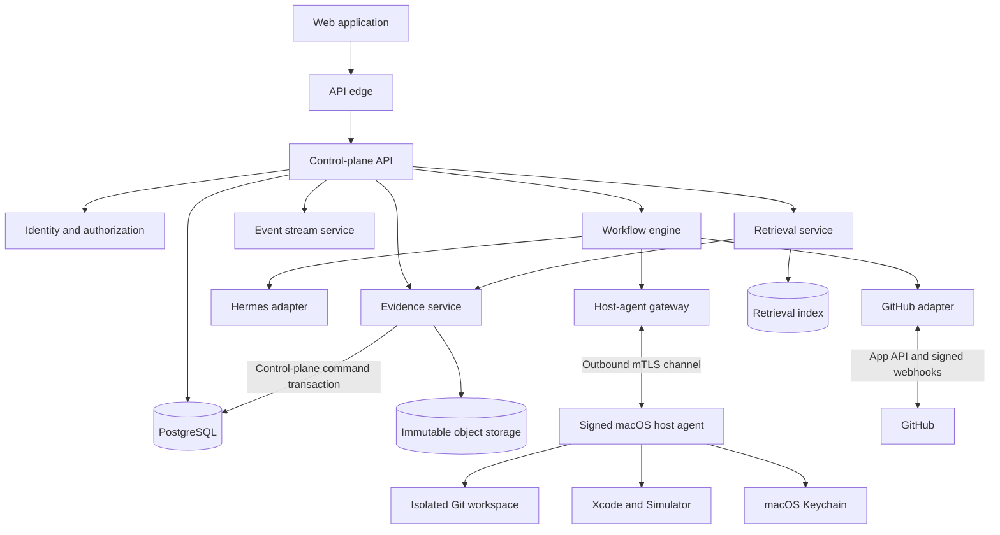

# Production Engineering Specification

## 1. Document status

**Status:** Proposed production baseline
**Audience:** Product, design, application engineering, platform engineering,
security, reliability, and operations
**Related documents:** `PRODUCT_WORKFLOW_ARCHITECTURE.md`,
`MVP_ENGINEERING_SPEC.md`, and `MVP_IMPLEMENTATION_BACKLOG.md`

This specification expands the validated MVP direction into a production system.
The MVP remains the first delivery slice; this document defines the architecture
and controls required before the product can serve multiple users, repositories,
and developer machines reliably.

## 2. Executive decision

Build a multi-tenant web control plane with a signed macOS execution agent.

- The **web application** is the primary product surface: chat, task cockpit,
  approvals, evidence, PR/CI state, rules, repository configuration, and
  administration.
- The **control plane** owns workflow state, policy, authorization, evidence
  metadata, audit history, prompts, integration state, and the only transaction
  path that may mutate canonical domain state.
- A durable **workflow service**, implemented with a workflow engine, is the sole
  logical initiator of task-state transitions and owns retries, timers, external
  signals, recovery, and long-running task execution. The engine and its
  activities do not write canonical state directly.
- **Hermes** remains the agent runtime. It proposes and executes work but is not
  authoritative for workflow state, evidence, or policy.
- A signed, outbound-only **macOS host agent** owns local Git workspaces, Xcode,
  Simulator, signing-sensitive operations, and artifact capture.
- **PostgreSQL** stores transactional state. **Object storage** stores immutable
  artifacts. A rebuildable **retrieval index** stores search projections.
- **GitHub** remains authoritative for commits, pull requests, reviews, and CI.

Pine remains an architectural reference for canonical evidence, idempotent
capture, verification, and quarantine. Production reimplements those
domain-neutral mechanics behind an internal Evidence Ledger interface; it does
not depend on Pine's financial schemas, migrations, UI, or local storage model.

The production UI remains browser-based. A Tauri shell may be added later for
notifications and local-host pairing, but it is not a system boundary or source
of truth.

## 3. Product goals

The production system must:

1. Convert a rough engineering request into a versioned brief authorized by
   human approval or a recorded, versioned low-risk policy bypass.
2. Implement the requested change in an isolated, attributable workspace.
3. Verify a real user outcome through configured iOS test and simulator flows.
4. Capture tamper-evident evidence for decisions, execution, tests, and reviews.
5. Repair bounded failures and escalate repeated or ambiguous failures.
6. Open and maintain a draft pull request through CI and review.
7. Keep humans in control of product decisions, sensitive actions, merge, and
   new engineering policy.
8. Improve retrieval, summaries, prompts, and rule proposals from verified
   delivery outcomes.
9. Make current state, evidence, cost, risk, and required decisions visible
   without reconstructing history from chat or raw logs.
10. Survive process, machine, network, and dependency failures without silently
    losing or duplicating work.

## 4. Non-goals

- Replacing GitHub, Git, Xcode, or existing CI.
- Allowing an agent to approve its own work or merge by default.
- Treating agent memory, vector search, or model output as authoritative evidence.
- Running arbitrary remote shell commands on developer machines.
- Automatically learning permissions, policies, or required validation rules.
- Storing production signing secrets in prompts, cloud logs, or general-purpose
  application databases.
- Guaranteeing that an AI-generated change is defect-free.

## 5. Design principles

### 5.1 Evidence before claims

Agent prose never proves completion. A transition is valid only when policy and
stored evidence satisfy its preconditions.

### 5.2 Separate truth from learning

Raw source evidence is immutable. Summaries, embeddings, classifications, and
rule candidates are versioned projections that can be rebuilt, superseded, or
revoked.

### 5.3 Durable orchestration

Long-running work is represented by deterministic workflow state, not by an
open HTTP request, an agent transcript, or a process-local job queue.

### 5.4 Least privilege by state

Agents and host operations receive only the capabilities needed for the current
workflow state and repository.

### 5.5 Local trust stays local

Xcode, Simulator, local repositories, and signing credentials stay behind the
macOS host-agent boundary. The control plane sends typed operations, not shell
strings.

### 5.6 Human policy ownership

Automation may propose and evaluate rules. A human must approve, revise,
supersede, or revoke policy.

## 6. Production architecture



### 6.1 Logical services

The initial production deployment may combine services in a modular monolith.
The following ownership boundaries must remain explicit so they can scale or
isolate independently:

| Component | Authoritative responsibility |
| --- | --- |
| Web application | Rendering, interaction, optimistic UI, and local drafts |
| API edge | TLS termination, request limits, routing, and request identity |
| Identity service | SSO/OIDC, sessions, tenant membership, and service identity |
| Control-plane API | Tasks, configuration, approvals, policy, read models, and the sole transactional command path for canonical domain mutations |
| Workflow service | Sole logical initiator of task transitions; durable state machines, retries, timers, signals, and cancellation |
| Event service | Replay, live delivery, and fan-out of committed task events; no canonical writes |
| Evidence service | Canonicalization, hashing, artifact manifests, retention, and verification; metadata acceptance through the command path |
| Retrieval service | ACL-aware lexical/semantic retrieval and evaluation |
| Prompt compiler | Versioned role prompts built from approved state and verified context |
| Hermes adapter | Run lifecycle and normalized Hermes event translation |
| GitHub adapter | App authentication, PR/check/review synchronization, and webhooks |
| Host gateway | Device registration, outbound sessions, typed job delivery, and heartbeats |
| macOS host agent | Local workspace, build, simulator, logs, and signing-sensitive actions |

### 6.2 Recommended production technologies

| Concern | Production baseline |
| --- | --- |
| Web UI | Next.js, React, and TypeScript |
| Control-plane services | FastAPI/Python with generated OpenAPI clients |
| Durable workflow | Temporal Cloud or a production-operated Temporal cluster |
| Transactional storage | Managed PostgreSQL with point-in-time recovery |
| Retrieval | PostgreSQL full-text search plus pgvector initially |
| Artifact storage | Versioned object storage with retention lock and KMS encryption |
| Cache/rate limits | Managed Redis |
| Live browser updates | Server-Sent Events with cursor-based replay |
| Internal events | Transactional outbox; managed queue/event bus for fan-out |
| Host agent | Signed and notarized macOS service; Swift preferred for the hardened production binary |
| Service deployment | Containers on a managed orchestration platform |
| Infrastructure | Terraform or equivalent reviewed infrastructure as code |
| Secrets | Managed secret store; Keychain for developer-machine secrets |

Temporal is a production requirement because tasks may wait hours or days for
approval, CI, a host machine, or review. Workflow code must tolerate replay and
therefore must not perform non-deterministic side effects outside activities.

## 7. Environments and deployment topology

### 7.1 Environments

- **Local:** developer services, disposable data, fake integrations, and a local
  host agent.
- **Preview:** per-PR UI/API deployments with mocked GitHub, Hermes, and host
  operations. Preview environments never receive customer repositories or
  production credentials.
- **Development:** shared integration environment using test GitHub organizations
  and synthetic repositories.
- **Staging:** production-equivalent topology, isolated tenant data, real webhook
  delivery, and dedicated macOS test hosts.
- **Production:** multi-AZ control plane, managed database, immutable object
  storage, production identity, and tenant-scoped GitHub Apps.

No production evidence, secret, repository credential, or signing identity may
be copied into a lower environment.

### 7.2 Availability zones and regions

The control plane runs across at least two availability zones. PostgreSQL uses
multi-AZ synchronous replication. Object storage and the workflow engine use
managed regional durability. Initial deployment is single-region with a tested
cross-region restore path; active-active multi-region is deferred until required
by measured availability or residency needs.

### 7.3 Network boundaries

- Public ingress is limited to the web/API edge and GitHub webhook endpoint.
- Databases, queues, workflow workers, and object storage access use private
  networking.
- Services use workload identity and encrypted service-to-service transport.
- The macOS host agent opens an outbound authenticated channel; it requires no
  inbound firewall exception.
- Administrative database and production shell access are denied by default and
  use audited break-glass procedures.

## 8. Identity, tenancy, and authorization

### 8.1 Identities

Supported principals:

- human user;
- tenant service account;
- GitHub App installation;
- registered macOS host;
- internal service workload;
- Hermes run/agent identity.

Each persisted mutation records tenant, principal type, principal identifier,
request identifier, and authorization decision.

### 8.2 Authentication

- Human users authenticate with OIDC; enterprise SAML can be brokered through
  the identity provider.
- Browser sessions use short-lived, secure, HTTP-only cookies with CSRF defense.
- Hosts enroll with a one-time code and receive a rotatable device certificate.
- Internal services use workload identity rather than static shared tokens.
- GitHub App installation tokens are short-lived and generated per operation.

Revoked users, sessions, service identities, hosts, certificates, and GitHub
installations lose mutation and retrieval access within five minutes, with
immediate best-effort cache/session invalidation.

### 8.3 Roles

The authorization hierarchy is:

```text
Organization (tenant) -> Workspace -> Repository -> Task
```

A host enrolls into one workspace and receives explicit repository grants. A
retrieval or artifact request is authorized at every level; organization
membership alone does not imply access to every repository.

Minimum tenant roles:

| Role | Capabilities |
| --- | --- |
| Viewer | Read tasks and evidence allowed by repository scope |
| Contributor | Create/steer tasks and inspect artifacts |
| Approver | Decide task approvals and review escalations |
| Rule owner | Approve, supersede, and revoke engineering rules |
| Repository admin | Configure repositories, validation contracts, and hosts |
| Tenant admin | Manage members, retention, integrations, and audit export |

Authorization evaluates tenant, role, repository access, task classification,
and operation. Database row-level security provides defense in depth but does
not replace application authorization.

Separation-of-duties policy may prohibit a proposer from approving the same
organization-wide rule, release-sensitive action, or signing request. General
availability requires two authorized reviewers for organization-wide policy.
Sensitive approvals use step-up authentication and record authentication context.

## 9. Workflow model

### 9.1 Canonical task states

```text
DRAFT -> BRIEFING
BRIEFING -> READY                            (recorded policy bypass)
BRIEFING -> BRIEF_PENDING_APPROVAL -> READY (human approval)
READY
  -> WAITING_FOR_HOST
  -> IMPLEMENTING
  -> VALIDATING
  -> REPAIRING -> VALIDATING
  -> READY_FOR_PR
  -> PR_DRAFTED
  -> PR_ACTIVE
  -> RESOLVING_REVIEW
  -> REVALIDATING -> PR_ACTIVE
  -> READY_FOR_HUMAN_MERGE
  -> MERGED
  -> DELIVERED

READY_FOR_HUMAN_MERGE -> HANDED_OFF

PR_ACTIVE or READY_FOR_HUMAN_MERGE
  -> RECONCILING_EXTERNAL_HEAD
  -> REVALIDATING
  or -> recorded_origin_state when reconciliation proves no effective head change

Any resumable work/wait state -> PAUSED(resume_state) -> resume_state
Any decision-capable work/wait state
  -> ESCALATED(resume_state, decision_required)
  -> policy_allowed_destination
Any non-terminal state except CANCELLING -> CANCELLING -> CANCELLED
Any non-terminal, non-cancelling state -> FAILED
```

### 9.2 Workflow invariants

- The workflow service is the sole logical initiator of canonical task-state
  transitions. Users, operators, approvals, GitHub, hosts, and other services
  submit typed commands, decisions, or signals; they never select or write a
  destination state directly.
- Every canonical database mutation is executed by a control-plane command
  handler in one PostgreSQL transaction; task-state changes use the transition
  command variant. Neither Temporal workflow code nor a Temporal activity writes
  task rows, task events, approvals, evidence metadata, or external-effect
  intent directly.
- Each transition requires an expected prior state and monotonically increasing
  task version.
- Side effects use idempotency keys derived from workflow and activity IDs.
- An accepted cancellation-request command immediately marks cancellation
  pending, increments the execution generation, and prevents new capability
  issuance in its control-plane transaction before it signals the workflow.
  The workflow remains the sole logical initiator of the subsequent
  `CANCELLING` transition and requests cooperative interruption of current
  agent/host operations.
- `READY_FOR_HUMAN_MERGE` requires an immutable validation decision, current PR head
  revision, required CI conclusion, and absence of unresolved blocking reviews.
- `HANDED_OFF`, `MERGED`, and `DELIVERED` are distinct successful outcomes.
  Verified PR readiness, GitHub merge, and released delivery must never be
  collapsed into an ambiguous `COMPLETE` state.
- A new commit invalidates validation attached to an older revision unless policy
  explicitly declares a check revision-independent.
- Each approval binds to a canonical hash of the exact brief, scope, diff,
  policy, and evidence snapshot being approved. A material change invalidates
  it and creates a new approval request.
- Every completed brief has exactly one recorded approval disposition:
  `AUTO_ACCEPTED_BY_POLICY` or `HUMAN_APPROVAL_REQUIRED`. Automatic acceptance is
  allowed only when every required brief field is complete, no ambiguity or
  scope-expansion flag remains, the change is low risk, sensitive/prohibited
  paths are absent, and every requested operation is already allowlisted. The
  decision records the exact brief/scope hash, evaluated inputs, policy version,
  and reason. A caller cannot request or approve its own bypass, and a material
  change invalidates it just as it invalidates human approval.
- Expired approvals fail closed.
- Retry budgets are per failure class, not one unbounded global counter.
- Equivalent repeated failures are detected by normalized failure fingerprints.
- CI checks and reviews are concurrent conditions within `PR_ACTIVE`; neither is
  modeled as necessarily preceding the other.
- `PAUSED` resumes only to its recorded `resume_state` after policy revalidation.
  `ESCALATED` resumes only through an approval decision that names the destination
  state and is still valid for the current task/scope/evidence snapshot.
- An effective external PR head change from either `PR_ACTIVE` or
  `READY_FOR_HUMAN_MERGE` moves the task to `RECONCILING_EXTERNAL_HEAD`.
  The system captures the new Git/GitHub state, invalidates stale validation and
  approvals, synchronizes a clean workspace, and revalidates before returning to
  `PR_ACTIVE`. A stale or duplicate signal may return only to the recorded
  origin state after reconciliation proves the head and readiness inputs did not
  change.

### 9.3 Signals and timers

Workflows accept external signals for:

- brief approval or revision;
- host availability;
- user steering;
- GitHub check/review updates;
- security or policy revocation;
- cancellation;
- rule decision.

Timers cover approval expiry, host lease expiry, webhook reconciliation, CI
timeouts, retry backoff, artifact-upload expiry, and retention transitions.

### 9.4 Transition contract

The workflow service is the logical initiator for every row below. The
`Required trigger/authority` column names an input the workflow must consume,
not another component that may mutate state. The workflow submits the proposed
transition to the control-plane transition command handler; that handler alone
checks the expected state/version and commits the transition, event, and related
intent in PostgreSQL.

| Transition | Required precondition/evidence | Required trigger/authority |
| --- | --- | --- |
| `DRAFT -> BRIEFING` | Repository access and current request revision | Authorized requester or operator start command |
| `BRIEFING -> READY` | Valid structured brief, criteria, risk, and validation plan plus an `AUTO_ACCEPTED_BY_POLICY` disposition bound to the exact brief/scope hash, evaluated inputs, policy version, and reason | Workflow policy evaluation; no caller-selectable bypass |
| `BRIEFING -> BRIEF_PENDING_APPROVAL` | Valid structured brief, criteria, risk, and validation plan plus a `HUMAN_APPROVAL_REQUIRED` disposition | Workflow policy evaluation; no external authority |
| `BRIEF_PENDING_APPROVAL -> READY` | Unexpired approval bound to brief/scope/policy hash | Authorized approver decision |
| `BRIEF_PENDING_APPROVAL -> BRIEFING` | Revision rationale and a new brief generation; prior approval request closed | Authorized approver revision decision or requester replacement command |
| `READY -> WAITING_FOR_HOST` | Exact brief version has a valid human approval or recorded policy bypass, repository config is valid, and execution budget is available | Workflow condition; no external authority |
| `WAITING_FOR_HOST -> IMPLEMENTING` | Compatible host lease and task capability | Authenticated host availability signal |
| `IMPLEMENTING -> VALIDATING` | Captured diff/revision/tool evidence; no prohibited mutation | Successful implementation result for the current execution generation |
| `VALIDATING -> REPAIRING` | Required failure, remaining class-specific retry budget, and novel repair intent | Failed validation result for the current revision |
| `REPAIRING -> VALIDATING` | New repair revision, captured diff/tool evidence, and repair-attempt record; no prohibited mutation | Successful repair result for the current execution generation |
| `VALIDATING -> READY_FOR_PR` | All required criteria pass for current revision | Verified validation decision |
| `READY_FOR_PR -> PR_DRAFTED` | Idempotent GitHub PR mapping for validated head | Reconciled GitHub create/update result |
| `PR_DRAFTED -> PR_ACTIVE` | Captured PR/head snapshot and webhook mapping | Reconciled GitHub PR state |
| `PR_ACTIVE -> RESOLVING_REVIEW` | Actionable in-scope feedback and any approval required by policy | Reconciled review signal and, when required, authorized approval |
| `RESOLVING_REVIEW -> REVALIDATING` | New committed/pushed head and response evidence | Successful review-resolution result |
| `REVALIDATING -> PR_ACTIVE` | Required validation passes for updated PR head | Verified validation decision |
| `PR_ACTIVE or READY_FOR_HUMAN_MERGE -> RECONCILING_EXTERNAL_HEAD` | GitHub reports a head SHA not owned by the current execution generation or different from the recorded head | Verified GitHub delivery or scheduled reconciliation result |
| `RECONCILING_EXTERNAL_HEAD -> REVALIDATING` | Authoritative Git/GitHub snapshot captured, stale validation/approvals invalidated, and clean workspace synchronized to the new head | Successful reconciliation showing an effective head change |
| `RECONCILING_EXTERNAL_HEAD -> recorded_origin_state` | Authoritative Git/GitHub snapshot proves the signal was stale or duplicate and the recorded head, validation, approvals, and policy remain current | Successful reconciliation showing no effective head change |
| `PR_ACTIVE -> READY_FOR_HUMAN_MERGE` | Checks pass and no unresolved blocking review for current head | Reconciled CI/review conditions |
| `READY_FOR_HUMAN_MERGE -> HANDED_OFF` | Verified evidence bundle and explicit handoff | Authorized operator handoff command |
| `READY_FOR_HUMAN_MERGE -> MERGED` | Reconciled GitHub merge event for approved head | Verified GitHub delivery or scheduled reconciliation result |
| `MERGED -> DELIVERED` | Repository-defined delivery evidence, when tracked | Verified delivery signal or authorized operator attestation |
| `Any resumable work/wait state -> PAUSED(resume_state)` | A safe boundary is reached, the exact prior state/version is recorded, and no new effect can dispatch | Authorized pause command or typed dependency/safety condition |
| `PAUSED -> recorded resume_state` | Authorization, policy, capability, evidence freshness, and destination preconditions are revalidated | Authorized resume command or configured dependency-recovery signal |
| `Any decision-capable work/wait state -> ESCALATED(resume_state, decision_required)` | Typed blocker evidence, decision schema, allowed destinations, and exact resume state are recorded | Workflow-detected decision requirement, including exhausted or ambiguous retry paths |
| `ESCALATED -> policy_allowed_destination` | Unexpired authorized decision binds to the current task/scope/evidence snapshot and explicitly names an allowed destination | Authorized escalation decision |
| `Any non-terminal state except CANCELLING -> CANCELLING` | Cancellation request/reason is recorded; execution generation has been incremented; outstanding capabilities, leases, and new dispatch are fenced | Authorized cancellation command, rejected brief where policy defines rejection as cancellation, or mandatory policy/security cancellation |
| `CANCELLING -> CANCELLED` | In-flight effects are quiesced or conclusively fenced, ambiguous effects are reconciled, and cleanup outcome is recorded | Workflow cancellation/reconciliation condition |
| `Any non-terminal, non-cancelling state -> FAILED` | Typed terminal cause is evidenced; policy permits no retry, rework, reconciliation, or human-decision path; outstanding mutations are reconciled or fenced | Workflow terminal-failure condition |

“Resumable work/wait state” and “decision-capable work/wait state” exclude
terminal states, `PAUSED`, `ESCALATED`, and `CANCELLING`. `recorded_origin_state`
is only `PR_ACTIVE` or `READY_FOR_HUMAN_MERGE`; other destinations are rejected.
An escalation decision may return to its recorded resume state, name a
policy-defined rework/reconciliation state, or request `CANCELLING`; it cannot
invent a state or bypass a normal transition guard.

The transition command transaction creates durable workflow steps or
external-effect intent before an effect can dispatch, then appends the task
event and evidence references with the state update. Timeouts produce a typed
blocker, safe retry, or escalation; they never imply success. Cancellation
cleanup failure is retained as evidence but, once all capabilities and
generation writes are conclusively fenced, does not keep a task in
`CANCELLING` indefinitely.

### 9.5 Execution statuses

Workflow runs, steps, attempts, agent runs, and host operations use independent
statuses: `QUEUED`, `LEASED`, `RUNNING`, `WAITING`, `SUCCEEDED`, `FAILED`,
`TIMED_OUT`, `CANCELLING`, `CANCELLED`, and `SUPERSEDED`. A task cancellation
increments its execution generation. Results from an older generation are stored
as evidence but cannot commit state or external mutations.

### 9.6 PostgreSQL and Temporal consistency contract

PostgreSQL is the sole authority for user-visible domain state, approvals,
policy, evidence metadata, and external-effect intent. Temporal is authoritative
only for workflow execution history, durable timers, retries, and activity
progress. Every canonical PostgreSQL mutation goes through an authorized,
version-checked control-plane command transaction. Temporal workflow code,
Temporal activities, adapters, dispatchers, and reconcilers have no direct
canonical-table write path; production credentials enforce this boundary.

The command protocol is:

1. An external actor or integration submits a typed command or signal with
   tenant, idempotency key, expected task version, and actor/source identity.
2. The control-plane command handler authorizes and validates it in one
   PostgreSQL transaction. The transaction records the command, decision, or
   ingress receipt and an outbox event. It may create or mutate non-state domain
   records covered by the command and apply immediate cancellation fencing, but
   it does not let the caller choose a task destination state.
3. The outbox dispatcher signals or starts the Temporal workflow using a stable
   workflow/run key and references to the persisted input. Duplicate delivery
   is safe.
4. The deterministic workflow evaluates the persisted authorized inputs and is
   the sole logical initiator of a transition. It submits a typed transition
   command containing expected state, state version, execution generation,
   evidence references, and a stable transition idempotency key.
5. The control-plane transition command transaction rechecks authorization,
   policy, evidence, state/version, and generation, then atomically updates the
   task, appends task events, records workflow-step/external-effect intent, and
   writes any outbox event. A rejected transition returns a typed conflict to
   the workflow; Temporal history is never used to overwrite PostgreSQL.
6. Before any external side effect, an activity requests its already-authorized
   pending intent through the control plane and receives a scoped capability and
   fencing token. The activity performs only that typed effect and cannot update
   canonical tables.
7. Activity results enter a durable inbox as uncommitted observations. The
   workflow submits a result/transition command, and a control-plane transaction
   checks task version, execution generation, fencing token, current policy, and
   evidence integrity before accepting the result or advancing state.

If PostgreSQL commits but Temporal does not observe the signal, the outbox
retries. If Temporal observes a signal more than once, the command idempotency
record returns the original result. If an activity cannot tell whether an
external effect occurred, it reconciles the pending intent against the host,
Hermes, or GitHub before retrying. A periodic reconciler compares open domain
records with Temporal workflows and submits typed commands or repairs missing
signals through the same outbox/command protocol. It never writes canonical
state directly or derives domain truth from Temporal history.

## 10. Public API contract

### 10.1 Conventions

- Base path: `/api/v1`.
- JSON uses UTF-8 and RFC 3339 timestamps.
- IDs use UUIDv7 internally, are exposed as opaque values, and never encode
  tenant or authorization.
- Mutations accept `Idempotency-Key`.
- Mutable resources expose `version` and support `If-Match`.
- List endpoints use stable cursor pagination.
- SSE supports `Last-Event-ID`; reconnect replays durable events after the
  supplied task sequence before switching to live delivery.
- Errors use a structured problem format with `code`, `message`, `retryable`,
  `request_id`, and optional field details.
- Every request and event carries a correlation ID.
- OpenAPI is the source for generated TypeScript and host clients.
- Additive changes are backward-compatible; breaking changes require a new API
  version and migration window.

### 10.2 Core endpoints

#### Tasks and chat

| Method | Path | Purpose |
| --- | --- | --- |
| `POST` | `/tasks` | Create a task |
| `GET` | `/tasks` | List tasks visible to the caller |
| `GET` | `/tasks/{task_id}` | Read task and current projections |
| `POST` | `/tasks/{task_id}/messages` | Add user steering/context |
| `POST` | `/tasks/{task_id}/cancel` | Request cancellation |
| `POST` | `/tasks/{task_id}/pause` | Pause before the next safe boundary |
| `POST` | `/tasks/{task_id}/resume` | Resume a paused task |
| `GET` | `/tasks/{task_id}/events` | Replay task events |
| `GET` | `/tasks/{task_id}/stream` | SSE updates after a cursor |

#### Briefs and approvals

| Method | Path | Purpose |
| --- | --- | --- |
| `GET` | `/tasks/{task_id}/briefs` | List brief versions and approval dispositions |
| `POST` | `/tasks/{task_id}/briefs/{version}/submit` | Finalize a brief for approval-disposition evaluation |
| `GET` | `/approvals` | List actionable approvals |
| `GET` | `/approvals/{approval_id}` | Read approval with evidence |
| `POST` | `/approvals/{approval_id}/decisions` | Approve, revise, reject, or defer |

Brief reads expose the immutable approval disposition, exact brief/scope hash,
policy version, evaluated-input hash, reason, and any human approval reference.
There is no public “bypass approval” endpoint: only the workflow's versioned
policy evaluation can create `AUTO_ACCEPTED_BY_POLICY`, through the canonical
command transaction.

#### Evidence and validation

| Method | Path | Purpose |
| --- | --- | --- |
| `GET` | `/tasks/{task_id}/evidence` | List evidence metadata |
| `POST` | `/evidence/uploads` | Obtain a scoped upload session |
| `POST` | `/evidence/uploads/{upload_id}/complete` | Verify and finalize an upload |
| `GET` | `/evidence/{evidence_id}` | Read manifest and authorized download URL |
| `GET` | `/tasks/{task_id}/validations` | List validation runs |
| `GET` | `/validations/{validation_id}` | Read criterion-level results |

#### Repositories, hosts, and integrations

| Method | Path | Purpose |
| --- | --- | --- |
| `GET/POST` | `/repositories` | List or connect repositories |
| `GET/PATCH` | `/repositories/{repository_id}` | Read/update repository configuration |
| `POST` | `/repositories/{repository_id}/validate-config` | Validate integration and test contract |
| `GET` | `/hosts` | List enrolled macOS hosts |
| `POST` | `/hosts/enrollment` | Create a one-time enrollment |
| `POST` | `/hosts/{host_id}/revoke` | Revoke host identity |
| `POST` | `/webhooks/github` | Receive signed GitHub events |

#### Rules and evaluation

| Method | Path | Purpose |
| --- | --- | --- |
| `GET` | `/rule-candidates` | List candidate rules |
| `GET` | `/rule-candidates/{id}` | Read evidence and evaluation |
| `POST` | `/rule-candidates/{id}/decisions` | Approve, revise, reject, or defer |
| `GET` | `/rules` | List active and historical rules |
| `POST` | `/rules/{id}/supersede` | Replace an approved rule |
| `POST` | `/rules/{id}/revoke` | Revoke a rule |
| `GET` | `/evaluations` | Query prompt/retrieval outcome evaluations |

#### Workflow, agent, and host operations

| Method | Path | Purpose |
| --- | --- | --- |
| `GET` | `/tasks/{task_id}/workflow-runs` | Read workflow/step/attempt status |
| `GET` | `/tasks/{task_id}/agent-runs` | Read normalized Hermes runs |
| `POST` | `/agent-runs/{run_id}/cancel` | Request agent cancellation |
| `GET` | `/hosts/{host_id}/operations` | Read authorized host operation history |
| `POST` | `/host-operations/{operation_id}/cancel` | Request cooperative cancellation |
| `GET` | `/tasks/{task_id}/retrieval-sets` | Inspect frozen retrieval inputs |

The public browser/API contract is REST/OpenAPI. The outbound host channel uses
versioned protobuf messages over gRPC streaming or an equivalently typed mTLS
stream. GitHub uses signed HTTP webhooks. Internal asynchronous messages use the
common event envelope and transactional outbox.

### 10.3 Event envelope

Every task event uses a common envelope:

```json
{
  "event_id": "opaque",
  "tenant_id": "opaque",
  "task_id": "opaque",
  "sequence": 42,
  "event_type": "validation.completed",
  "occurred_at": "2026-07-29T18:00:00Z",
  "recorded_at": "2026-07-29T18:00:01Z",
  "actor": {"type": "host", "id": "opaque"},
  "correlation_id": "opaque",
  "causation_id": "opaque",
  "schema_version": 1,
  "payload": {}
}
```

Task sequences are strictly increasing. Consumers de-duplicate on `event_id`.
An event is immutable after acceptance. Sensitive raw payloads are stored as
evidence and referenced from a sanitized event projection.

## 11. Host-agent protocol

### 11.1 Connection model

The host agent maintains one outbound bidirectional gRPC stream over HTTP/2 and
mTLS to the host gateway. Versioned protobuf messages carry enrollment,
capabilities, heartbeats, job offers, progress, cancellation, and results. The
server never initiates a direct inbound connection. WebSocket and long-poll
transports are not part of the GA protocol.

### 11.2 Typed operations

Initial operations:

- `workspace.create`
- `workspace.status`
- `workspace.read_file`
- `workspace.search`
- `workspace.list_files`
- `workspace.diff`
- `workspace.cleanup`
- `repository.bootstrap`
- `git.status`
- `git.fetch`
- `git.apply_patch`
- `git.commit`
- `git.push`
- `build.xcode`
- `test.xcode`
- `simulator.prepare`
- `simulator.run_flow`
- `logs.capture`
- `artifacts.upload`
- `operation.cancel`

Operation payloads use validated fields and repository-relative paths. No
operation accepts arbitrary shell text. Repository configuration defines
allowed schemes, destinations, test plans, environment keys, and artifact roots.

`workspace.search` accepts a bounded query, path filters, result/byte limits, and
no executable expression. `repository.bootstrap` selects a versioned named
bootstrap recipe from repository configuration; it cannot supply a command at
runtime. `git.push` accepts only the task branch/refspec and uses a short-lived
GitHub App credential through an ephemeral credential helper. Credential bytes
are never returned to Hermes or persisted in host output.

### 11.3 Job lifecycle

`offered -> accepted -> running -> uploading -> completed`

Alternative terminal states are `rejected`, `cancelled`, `timed_out`, and
`failed`. Jobs have leases. A lost lease does not automatically replay a
non-idempotent operation; the workflow reconciles host state first.

### 11.4 Host hardening

- Signed and notarized builds with verified automatic updates.
- Keychain-backed device key and local secrets.
- Per-job capability token bound to host, repository, task, operation, and expiry.
- Dedicated workspace root with path traversal and symlink escape prevention.
- Resource limits and child-process tree cancellation.
- Redaction before logs leave the host.
- Explicit user/admin consent for signing or release-sensitive operations.
- Software version policy that can quarantine outdated or revoked agents.

### 11.5 Build-execution isolation

Typed operations are necessary but not sufficient. `xcodebuild` can execute
repository-controlled build phases, package plugins, test helpers, and scripts.
The repository and its build graph must therefore be treated as hostile
executable input.

The execution profile is recorded on the host, task, operation, evidence
manifest, and audit events. The GA profile requires one ephemeral macOS VM per
task from a signed, versioned hardened image. The VM is tenant- and
repository-bound for that task and is destroyed after terminal cleanup; it is
not reassigned to another tenant without verified destruction and reprovisioning.
A restricted account on a developer's normal macOS installation is not an
equivalent GA boundary.

The ownership boundary is explicit:

- The control plane and host gateway own host/workload identity, attestation
  requirements, repository grants, scheduling, job leases, fencing,
  capability issuance/revocation, and authenticated ingress of result/evidence
  manifests. Canonical result/evidence acceptance remains a control-plane
  command transaction.
- A fleet/VM provider owns provisioning, hypervisor isolation, hardened-image
  application, and destruction. The gateway may request lifecycle operations
  from that provider but receives no general shell, filesystem, Keychain, or
  simulator access.
- The signed host agent inside the VM owns the task workspace, process tree,
  temporary credentials, Xcode/Simulator resources, artifact capture, and local
  operation journal. It executes typed capabilities only and cannot decide
  workflow state, policy, authorization, or evidence acceptance.
- Whether the fleet/VM provider is platform-operated or tenant-operated is
  configuration and contract metadata; it does not change these logical
  responsibilities or permit a shared task VM across tenants.

The VM requires:

- no access to the developer login Keychain, home directory, SSH agent, browser
  state, unrelated repositories, or distribution signing credentials;
- task-specific home, workspace, DerivedData, simulator data, caches, temporary
  directories, and process group;
- default-deny network egress with destination-scoped grants;
- fixed executable paths, a clean environment, resource limits, timeouts, and
  full child-process-tree termination;
- independently verified capability tokens containing tenant, repository, task,
  state, operation, policy version, nonce, and expiry;
- a durable local operation journal to reconcile reconnects without repeating
  mutations.

A persistent agent on a developer's normal login account is acceptable only for
an explicitly limited private beta and is treated as a user-accepted execution
risk, not a security isolation boundary. Repository build code can exercise the
ambient authority of that login account despite application-level path and tool
restrictions. Each such host therefore requires recorded consent from the host
owner and tenant/repository administrator, is bound to one tenant, one
workspace, and an explicit repository allowlist, and displays its beta profile
on every task and approval.

The developer-login beta profile permits only tenant-controlled repositories
with trusted contributors. It rejects untrusted forks or externally controlled
PR heads and cannot process `RESTRICTED` or specially regulated data, hold
distribution signing identities or production-customer credentials, perform
release/signing workflows, or accept work from another tenant. A head,
classification, repository ownership, or credential requirement that violates
those limits pauses dispatch and requires migration to the GA VM profile; an
approval cannot waive the boundary.

The GA sandbox acceptance suite provisions synthetic secrets in every denied
location, installs egress canaries, and runs at least 100 malicious repository
fixtures covering build phases, package plugins, test helpers, symlink/hard-link
escapes, process spawning, Keychain access, and network exfiltration. The gate
requires zero secret reads, zero filesystem escapes, and zero unapproved egress.

Distribution signing is a separate privileged workflow. Ordinary implementation
and validation jobs receive no distribution identity or private key.

## 12. Persistence model

### 12.1 PostgreSQL schemas

The column lists below are relational shorthand, not complete physical DDL.
Every tenant-owned physical table—including child, join, workflow, prompt,
integration, inbox, outbox, and reconciliation tables—contains `tenant_id` and
the applicable workspace, repository, task, or parent scope keys even when those
columns are omitted below for readability. Tenant and scope keys participate in
foreign keys, uniqueness constraints, idempotency keys, partitions/indexes, and
row-level-security policy; an unscoped child reference is not permitted.
`tenants.id` is the tenant boundary itself. A table may omit tenant scope only
when it is explicitly classified as global control-plane metadata, contains no
tenant payload or tenant-derived content, and has a documented authorization
and migration review.

Primary identifiers are opaque. Mutable tables use `version`, `created_at`, and
`updated_at`; these common columns may also be omitted from the shorthand below.
Append-only tables reject updates at the application and database layers.

#### Identity and configuration

- `tenants`: id, name, status, region, retention_policy_id.
- `workspaces`: id, tenant_id, name, status, default_classification,
  created_at.
- `users` (global identity-directory metadata; tenant membership exists only
  through scoped `principals`): id, external_subject, display_name, email,
  status.
- `service_accounts`: id, tenant_id, workspace_id, name, status, key_reference,
  created_at, revoked_at.
- `principals`: id, tenant_id, principal_type, user_id, service_account_id,
  host_id, status.
- `role_bindings`: id, tenant_id, principal_id, role, scope_type, scope_id,
  conditions, created_at, revoked_at.
- `repositories`: id, tenant_id, workspace_id, provider,
  provider_repository_id, default_branch, status, classification, config_version.
- `repository_configs`: repository_id, version, canonical_config, config_hash,
  created_by, created_at, superseded_at.
- `hosts`: id, tenant_id, workspace_id, device_public_key, certificate_serial,
  status, agent_version, capabilities, last_seen_at, revoked_at.
- `host_repository_grants`: tenant_id, workspace_id, host_id, repository_id,
  permissions, policy_version, expires_at.

#### Task and workflow

- `tasks`: id, tenant_id, workspace_id, repository_id, title, state, state_version,
  execution_generation, resume_state, reconciliation_origin_state,
  decision_required, terminal_reason_code, requester_id, base_revision,
  current_revision, active_brief_id, validation_contract_version, workflow_id,
  priority, classification, created_at, updated_at, terminal_at.
- `task_revisions`: id, task_id, revision, canonical_request, request_hash,
  scope_hash, created_by, created_at.
- `task_events`: event_id, tenant_id, task_id, sequence, event_type, actor_type,
  actor_id, correlation_id, causation_id, schema_version, sanitized_payload,
  occurred_at, recorded_at.
- `task_messages`: id, task_id, author_type, author_id, content_evidence_id,
  visibility, created_at.
- `briefs`: id, task_id, version, source_request_evidence_id, canonical_brief,
  brief_hash, scope_hash, prompt_template_version, status,
  approval_disposition, disposition_policy_version, disposition_input_hash,
  disposition_reason_evidence_id, approval_request_id, created_by, created_at.
- `acceptance_criteria`: id, brief_id, criterion_key, description, required,
  verification_method, status.
- `workflow_runs`: id, task_id, workflow_engine_id, workflow_type, status,
  started_at, closed_at.
- `workflow_steps`: id, workflow_run_id, step_type, generation, status,
  expected_task_version, started_at, completed_at.
- `activity_attempts`: id, workflow_run_id, activity_type, idempotency_key,
  attempt, status, failure_fingerprint, started_at, completed_at.
- `host_operations`: id, task_id, host_id, workflow_step_id, operation_type,
  operation_schema_version, input_hash, capability_id, fencing_token, lease_until,
  status, output_hash, started_at, completed_at.

#### Agent and prompt execution

- `agent_runs`: id, task_id, role, provider, model, hermes_session_id,
  prompt_version_id, retrieval_set_id, tool_policy_version, status, token_input,
  token_output, cost, started_at, completed_at.
- `agent_run_events`: id, agent_run_id, sequence, event_type,
  sanitized_payload, evidence_id, recorded_at.
- `prompt_templates`: id, role, semantic_version, template_hash, content,
  required_inputs, status, created_by, created_at.
- `prompt_evaluations`: id, prompt_template_id, evaluation_suite_id, result,
  metrics, created_at.
- `tool_policy_versions`: id, repository_id, semantic_version, policy,
  policy_hash, status, created_at.

#### Evidence and validation

- `evidence_records`: id, tenant_id, task_id, evidence_type, media_type,
  canonical_hash, object_key, byte_length, origin_type, origin_native_id,
  captured_at, captured_by_type, captured_by_id, parser_version,
  classification, retention_class, verification_status, supersedes_id,
  tombstoned_at, created_at.
- `evidence_edges`: from_evidence_id, to_evidence_id, relationship, created_at.
- `artifact_manifests`: evidence_id, encryption_key_reference, storage_version,
  signature, signed_at.
- `artifact_chunks`: tenant_id, evidence_id, ordinal, chunk_hash, byte_offset,
  byte_length.
- `validation_contracts`: id, repository_id, version, canonical_contract,
  contract_hash, status, created_at.
- `validation_runs`: id, task_id, contract_id, revision, host_id, status,
  environment_fingerprint, started_at, completed_at.
- `criterion_results`: id, validation_run_id, criterion_key, status,
  measured_values, failure_fingerprint.
- `criterion_evidence`: tenant_id, criterion_result_id, evidence_id,
  relationship.

#### Approvals, GitHub, and rules

- `approval_requests`: id, task_id, approval_type, status, requested_by_type,
  requested_by_id, requested_at, expires_at,
  policy_version, approval_snapshot_hash, task_version, decided_at.
- `approval_evidence`: tenant_id, approval_id, evidence_id, relationship,
  evidence_hash_at_request.
- `approval_decisions`: id, approval_id, decision, actor_id, rationale_evidence_id,
  created_at.
- `github_installations`: id, tenant_id, provider_installation_id, status,
  permissions_snapshot, created_at.
- `pull_requests`: id, task_id, repository_id, provider_pr_id, number, head_sha,
  base_sha, state, draft, last_synced_at.
- `github_deliveries`: delivery_id, installation_id, event_type, payload_hash,
  evidence_id, received_at, processed_at, status.
- `checks`: id, pull_request_id, provider_check_id, name, head_sha, status,
  conclusion, details_url, started_at, completed_at.
- `review_threads`: id, pull_request_id, provider_thread_id, path, line,
  status, blocking, last_synced_at.
- `review_comments`: id, review_thread_id, provider_comment_id, author_principal,
  commit_sha, body_evidence_id, in_reply_to_id, edited_at, captured_at.
- `rule_candidates`: id, tenant_id, workspace_id, repository_id, proposed_rule,
  status, recurrence, severity, false_positive_risk, evaluation_id, created_at.
- `rule_candidate_evidence`: tenant_id, rule_candidate_id, evidence_id,
  source_span, source_hash, relationship.
- `rules`: id, tenant_id, scope_type, scope_id, semantic_version, rule,
  rule_hash, status, owner_id, source_candidate_id, review_at, expires_at,
  effective_at, superseded_by, revoked_at.
- `policy_bundles`: id, tenant_id, scope_type, scope_id, semantic_version,
  canonical_policy, policy_hash, status, effective_at, superseded_at.

#### Retrieval and operations

- `derived_knowledge`: id, tenant_id, workspace_id, repository_id, knowledge_type,
  content, derivation_model, derivation_prompt_version, derivation_tool_version,
  status, approved_rule_id, created_at, superseded_at.
- `knowledge_citations`: tenant_id, derived_knowledge_id, evidence_id,
  source_span, source_hash, ordinal.
- `retrieval_chunks`: id, tenant_id, workspace_id, repository_id, classification,
  source_type, source_id, source_hash, source_span, chunk_hash, chunker_version,
  index_generation, ordinal, content, metadata, embedding_model, embedding,
  acl_projection_version, verifier_version, indexed_at.
- `retrieval_sets`: id, tenant_id, workspace_id, repository_id, task_id,
  query_hash, index_generation, reranker_version, acl_snapshot_hash,
  policy_version, verifier_version, token_estimate, created_at.
- `retrieval_set_items`: tenant_id, retrieval_set_id, retrieval_chunk_id,
  rank, lexical_score, semantic_score, rerank_score, chunk_hash.
- `retrieval_outcomes`: retrieval_set_id, agent_run_id, task_outcome,
  citation_score, usefulness_score, token_cost, evaluated_at.
- `audit_events`: id, tenant_id, principal_type, principal_id, action,
  resource_type, resource_id, authorization_result, request_id, metadata,
  occurred_at.
- `retention_holds`: id, tenant_id, resource_type, resource_id, hold_type,
  reason_evidence_id, effective_at, released_at.
- `idempotency_records`: tenant_id, key, operation, request_hash,
  response_status, response_body, expires_at.
- `inbox_events`: source, source_event_id, payload_hash, status, received_at,
  processed_at.
- `reconciliation_cursors`: integration_type, integration_id, cursor,
  last_reconciled_at.
- `outbox_events`: id, aggregate_type, aggregate_id, event_type, payload,
  available_at, published_at, attempt_count.

### 12.2 Required indexes and constraints

- Unique `(task_id, sequence)` for task events.
- Unique provider-native IDs scoped to installation/repository.
- Unique idempotency keys scoped to operation type and tenant.
- Tenant-scoped unique `(tenant_id, canonical_hash)` only where deduplication
  policy permits. APIs never reveal whether another tenant holds equal content.
- Partial indexes for actionable approvals, active tasks, unprocessed webhooks,
  active rules, and available outbox events.
- Vector and lexical indexes are partitioned or filtered by tenant/repository.
- Composite foreign keys include tenant and workspace where applicable and
  prevent relationships across tenant, workspace, or repository scope.
- Row-level security policies deny cross-tenant reads and writes.
- Scoped role bindings and grants are evaluated before every API, artifact,
  retrieval, SSE, workflow, and host operation.

### 12.3 Transaction pattern

A business mutation and its outbox event commit in one PostgreSQL transaction
opened by the control-plane command handler described in Section 9.6. Workers,
activities, adapters, and reconcilers submit commands or observations to that
handler rather than opening canonical-table write transactions. Workers publish
outbox events at least once. Consumers are idempotent. External side effects are
recorded with a pending operation before execution and reconciled after
ambiguous failures.

Artifact publication is two-phase: upload to a tenant-scoped temporary key with
a short-lived signed URL, verify size/hash/redaction manifest, atomically create
the trusted evidence record and final object reference, then garbage-collect
unreferenced temporary objects. A successful object upload alone is never
evidence.

## 13. Evidence Ledger

### 13.1 Source evidence

Source evidence includes authorized request/brief versions and their approval
dispositions, Git revisions, diffs, commands, tool invocations, test results,
simulator media, app/network logs, GitHub deliveries, reviews, CI results, and
human decisions.

Each record contains:

- canonical content hash;
- tenant, repository, task, and run relationships;
- origin and provider-native identifier;
- capture time and capturing principal;
- parser/extractor version;
- classification and retention class;
- lineage and supersession edges;
- storage manifest and verification state.

Structured evidence envelopes use RFC 8785 canonical JSON and SHA-256. Raw
artifact bytes are hashed independently from their metadata envelope. Readers
preserve the original schema version; migrations create adapters or new derived
records rather than rewriting historical evidence.

Three append-only records serve different purposes:

- **Task events** drive the readable cockpit timeline.
- **Audit events** preserve security and administrative accountability.
- **Evidence records** preserve attributable engineering inputs and outputs.

They may reference one another but are not interchangeable. Entire Hermes
transcripts are not promoted into the high-trust evidence corpus by default.

### 13.2 Immutability

- Artifact bytes are encrypted with a unique per-object data key. The wrapped
  key is tenant-scoped through KMS. Objects are stored in versioned storage with
  retention lock appropriate to their retention class.
- The canonical manifest is signed by a KMS-backed service key.
- Database metadata is append-only for authoritative fields.
- Periodic signed checkpoints cover ordered evidence manifests.
- Signed checkpoints use a hash chain or Merkle root and are anchored outside
  the primary database so a privileged database operator cannot replace both
  evidence metadata and its integrity proof unnoticed.
- Corrections use supersession or tombstone records.
- Deletion required by policy removes encryption material or eligible objects
  while retaining a minimal non-sensitive deletion audit record.

This is tamper-evident, not a claim that administrators can never destroy data.
Administrative access, retention changes, and key destruction are separately
audited and alertable.

Minimum lock periods are explicit policy: high-value approval, validation, and
security evidence defaults to 30 days; verbose logs/media may use zero or a
shorter lock when privacy policy requires faster erasure. Legal hold overrides
normal expiration. A deletion is “eligible” only when no legal/contractual hold
or minimum lock requires continued readable retention.

### 13.3 Verification states

`UPLOADING -> RECEIVED -> HASH_VERIFIED -> PARSED -> TRUSTED`

Alternative states: `QUARANTINED`, `REJECTED`, `TOMBSTONED`.

Only `TRUSTED` evidence is eligible for the high-trust retrieval corpus or
completion decisions. A parser failure does not change the raw artifact hash.

## 14. Continual learning and retrieval

### 14.1 Four-plane model

1. **SourceRecord:** authoritative immutable evidence.
2. **DerivedKnowledge:** versioned, cited, non-authoritative summaries and
   candidates.
3. **RetrievalIndex:** disposable lexical/vector/graph projections.
4. **Evaluation and Approval:** outcome measurement and human policy promotion.

### 14.2 Retrieval pipeline

1. Enforce tenant, repository, classification, and user access filters.
2. Retrieve lexical and semantic candidates.
3. Re-rank using task type, recency, evidence trust, and source diversity.
4. Prefer compact approved summaries with explicit source references.
5. Expand to exact source passages for uncertainty or high-impact decisions.
6. Persist the query policy, selected chunk IDs/hashes, token estimate, and
   downstream outcome.

Untrusted repository text, issue bodies, logs, and review comments are data, not
instructions. Retrieved content is isolated from system/tool policy and cannot
grant permissions.

### 14.3 What may improve automatically

- retrieval ranking and filters;
- multi-resolution summaries;
- task classification;
- prompt recommendations;
- test-plan suggestions;
- failure fingerprinting;
- candidate rule detection.

Automatic promotion requires a canary evaluation and remains reversible.
Permissions, tool policy, required validation, merge policy, and engineering
rules always require an authorized human decision.

A rule candidate becomes eligible for human promotion only after one confirmed
high-severity incident or two independent confirmed occurrences, plus cited
evidence, evaluation results, scope, owner, review date, expiry/review policy,
and a revocation path. Organization-wide rules require two-person approval.
Rejected candidates are retained as labeled evaluation feedback to reduce future
proposal noise; rejection never modifies source evidence.

### 14.4 Evaluation metrics

- citation precision and source coverage;
- stale-source and revoked-source rate;
- cross-tenant/access leakage rate;
- retrieval token cost;
- task completion and escalation rate;
- validation defect detection;
- false-positive review rate;
- retry count and elapsed delivery time;
- rule recurrence prevention after approval.

## 15. Prompt and agent execution

### 15.1 Role separation

Use distinct roles for briefing, implementation, validation analysis, PR
writing, review resolution, and independent final review. The implementer may
not be the sole authority declaring its change valid.

### 15.2 Prompt assembly

The prompt compiler receives:

- current authorized brief, approval disposition, and revision;
- repository guidance and validation contract;
- current workflow state;
- scoped tool policy;
- verified retrieval set;
- active human-approved rules;
- relevant prior failure evidence;
- expected structured output schema.

It records every input version and the final prompt hash. Secret values and raw
credentials are excluded. Large logs are summarized with links to exact evidence.

### 15.3 Structured outputs

Agent roles return validated schemas for plans, proposed changes, validation
analysis, review classification, repair intent, and rule candidates. Invalid
outputs are retried once with schema feedback, then escalated or handled by a
deterministic fallback.

### 15.4 Tool policy

- Tools are explicitly allowlisted by role and state.
- Filesystem operations are restricted to the task workspace.
- Network egress is denied by default and domain-scoped where required.
- External content never changes tool policy.
- Destructive, signing-sensitive, release, permission, or scope-expanding
  actions require policy evaluation and possibly approval.

### 15.5 Hermes governance contract

- Each tenant/workspace uses isolated Hermes profiles, sessions, memory, and
  skill storage. Cross-tenant session search or caches are prohibited.
- Delivery runs start with Hermes memory and autonomous skill writes disabled by
  default. Explicit repository-approved operational skills are mounted read-only
  by version and hash.
- A Hermes memory or skill proposal is non-authoritative and passes through the
  control-plane Rule/Skill Inbox. Retrieved delivery evidence can never silently
  update Hermes memory, skills, policy, or system instructions.
- Hermes approval prompts are transport pauses only. The adapter creates a
  control-plane approval request; only the recorded control-plane decision may
  release the operation.
- Every tool call is brokered through the control-plane tool gateway and bound
  to task state, repository, role, policy version, and capability. Hermes has no
  direct host, GitHub credential, secret-manager, or database access.
- Run creation uses a stable `(tenant, task, role, generation)` idempotency key.
  After an ambiguous start, the adapter queries Hermes before retrying and
  reconciles exactly one active run.
- The adapter declares a supported Hermes API/capability range. Unsupported
  versions fail closed, and rolling upgrades pass contract and replay tests.
- Hermes session/transcript retention follows tenant policy and is shorter than
  authoritative task/evidence retention unless selected content is explicitly
  captured as a source record.

## 16. iOS execution and validation

### 16.1 Repository contract

Each repository has a versioned configuration defining:

- project/workspace and allowed schemes;
- default branch and supported Xcode versions;
- simulator/device destinations;
- dependency/bootstrap operation;
- build, unit, integration, UI, and performance operations;
- deterministic end-to-end flows;
- required fixtures and test accounts;
- expected network/log signals and allowed warnings;
- prohibited paths and release-sensitive configuration;
- artifact and timeout limits.

Initial GA support targets the current and previous major macOS/Xcode releases
that Apple supports for the product's target SDKs. The web UI supports the
current and previous major Safari, Chrome, and Edge releases. The exact matrix is
published, exercised in CI/staging, and enforced during host enrollment.

### 16.2 Environment fingerprint

Every validation run records host-agent version, macOS version, Xcode build,
SDK/runtime, simulator model/runtime, dependency lock hashes, repository commit,
scheme/configuration, locale/time zone, and fixture version.

“Production-like” means production-equivalent compile settings and feature
composition with a test backend, synthetic fixtures, and non-production accounts
by default. Production endpoints, data, analytics destinations, remote
configuration, or release signing require a separately versioned environment
profile, threat review, and explicit approval.

### 16.3 Validation decision

A validation run produces criterion-level results: `PASS`, `FAIL`, `BLOCKED`,
or `NOT_APPLICABLE`. Required criteria cannot be `NOT_APPLICABLE` without an
approved contract exception. Missing or corrupt artifacts fail closed.

Validation contracts use typed assertions with deterministic verifiers:

| Assertion type | Required configuration |
| --- | --- |
| Build/test | operation, destination, expected result, timeout |
| UI flow | action sequence, stable selectors, required terminal state |
| Screenshot/visual | region, baseline version, tolerance, required review policy |
| Log | source, time window, required/forbidden pattern, count threshold |
| Crash | process/bundle scope and zero-crash requirement |
| Network | endpoint class, method, status/latency/error thresholds, redaction |
| Performance | metric, warm-up, repetitions, percentile, baseline, regression budget |
| Data/state | fixture version, query/assertion, expected canonical value |

Verifier code—not a model—produces the authoritative assertion result. A model
may explain evidence or propose a missing assertion but cannot convert a failed
deterministic result into a pass.

Failures are classified as `PRODUCT_DEFECT`, `TEST_DEFECT`, `INFRASTRUCTURE`,
`FLAKE`, `POLICY`, or `UNKNOWN`. Product defects enter repair. Infrastructure
failures retry without changing code. A flake requires a contract-defined number
of repetitions and statistical threshold before rerun or quarantine. Test defects,
policy failures, and unknown failures escalate rather than prompting arbitrary
code modification.

Test accounts and fixtures are provisioned through named versioned recipes.
Secrets are short-lived, injected only into the isolated VM, redacted from
artifacts, and destroyed when the VM is torn down.

### 16.4 Code signing

- Simulator tests should avoid signing-sensitive credentials where possible.
- Physical-device and distribution signing are separate privileged capabilities.
- Private keys remain in Keychain or managed signing infrastructure.
- The control plane stores certificate/team metadata, never private key material.
- Signing access requires explicit repository policy and auditable approval.

### 16.5 Repair loop

Repair prompts receive normalized failure fingerprints, changed files, current
revision, prior attempts, and precise evidence references. A new repair must
state why it differs from previous failed attempts. Per-class retry limits and
cost/time budgets prevent thrashing.

## 17. GitHub integration

### 17.1 GitHub App permissions

Baseline permissions:

- metadata: read;
- contents: read/write only for connected repositories;
- pull requests: read/write;
- checks/actions: read;
- issues: read for task context when enabled;
- webhooks: subscribed only to required events.

Merge, administration, secrets, environments, and workflow-file write
permissions are excluded by default.

The host pushes only the deterministic task branch using a short-lived
installation token and ephemeral Git credential helper. The token is restricted
to the connected repository, expires promptly, is never sent to Hermes, and is
destroyed after push. Branch creation, commit, push, and PR creation share a
stable delivery generation so retries cannot create duplicate branches or PRs.

### 17.2 Webhooks

Validate signature, installation, repository, event type, payload size, and
delivery ID before persistence. Store raw accepted payload as evidence. Return
quickly after durable receipt and process asynchronously. Reconcile with GitHub
periodically because webhooks may be delayed, duplicated, or dropped.

Initial subscriptions are limited to `pull_request`, `pull_request_review`,
`pull_request_review_comment`, `check_suite`, `check_run`, `workflow_run`,
`push`, `installation`, and `installation_repositories`. Unsupported event types
are acknowledged and ignored after validation. Active PRs reconcile at least
every five minutes while checks/reviews are incomplete and immediately after an
ambiguous API failure.

### 17.3 PR invariants

- PR head revision must equal the revision covered by required validation.
- CI conclusions are evaluated against a versioned repository policy.
- Review comments are classified as actionable, informational, conflicting,
  speculative, or scope-expanding.
- Automatic repair is limited to policy-classified low-risk, in-scope comments.
  Conflicting, speculative, release-sensitive, or scope-expanding feedback
  requires an approval bound to the proposed repair scope.
- The system never marks a thread resolved solely because code changed; it
  verifies the comment's concern and posts an attributable response.
- Human merge remains default. Any future auto-merge capability is a separate
  policy and security review.

### 17.4 Review model and operations

Normalize PR reviews, top-level conversation comments, inline threads, replies,
file/line anchors, author, commit SHA, resolution state, edit history snapshot,
and blocking classification. Provider-native IDs remain unique within the
repository/installation.

Supported writes are create/update PR description, add an attributable PR
comment, reply to an inline review thread, request re-review, and resolve a
thread only after the concern is verified. Every write is idempotent and records
the exact head SHA and agent/human actor. If a line anchor becomes stale, the
system preserves the original thread and links the response to the updated diff
rather than pretending the old anchor still applies.

Required checks are reconciled from branch protection/rulesets plus the
repository policy snapshot. A policy change or externally pushed head invalidates
the readiness decision and returns the task to reconciliation/revalidation.

## 18. Security and threat model

### 18.0 Trust boundaries

- Browser/UI is untrusted input; the server authorizes every request.
- The control plane is authoritative for delivery state and policy.
- PostgreSQL and object storage are authoritative for metadata and source
  evidence respectively.
- Hermes/model runtime is an untrusted proposer/executor.
- GitHub is externally authoritative for SCM state, while webhook/comment
  content remains untrusted input.
- The ephemeral macOS VM is a privileged but disposable execution boundary.
- A private-beta developer-login host is not an isolation boundary; the
  developer account and every resource reachable by it are inside the accepted
  risk boundary and are subject to the restrictions in Section 11.5.
- Repository/build content is hostile executable input.
- Derived knowledge and retrieval results can inform but never authorize.

### 18.1 Protected assets

- source code and proprietary artifacts;
- GitHub and identity credentials;
- signing keys and test-account secrets;
- user and tenant data;
- workflow policy and approved rules;
- evidence integrity and audit history;
- developer-machine access.

### 18.2 Primary threats and controls

| Threat | Required controls |
| --- | --- |
| Cross-tenant data exposure | Tenant-scoped authorization, RLS, object-key isolation, ACL-aware retrieval tests |
| Compromised browser/session | Short sessions, CSRF defense, MFA through IdP, sensitive-action reauthentication |
| Compromised host | Device certificates, outbound-only channel, revocation, typed operations, workspace sandbox |
| Malicious repository content | Prompt-injection isolation, no instruction inheritance, restricted tools and egress |
| Artifact tampering | Hash verification, signed manifests, object retention lock, checkpoint audit |
| GitHub webhook spoofing | Signature validation, delivery deduplication, installation/repository verification |
| Agent privilege escalation | State/role tool policy, structured operations, server-side authorization |
| Secret exfiltration | Keychain/secret manager, redaction, egress policy, no secrets in prompts |
| Supply-chain compromise | Locked dependencies, SBOM, artifact signing, provenance, vulnerability scanning |
| Unsafe learned policy | Candidate-only learning, evaluation, human approval, versioning and rollback |
| Denial of service/cost runaway | Quotas, concurrency limits, token/time budgets, circuit breakers |

### 18.3 Security development lifecycle

- Threat-model review for every new external integration or privileged host
  operation.
- Static analysis, dependency scanning, secret scanning, container scanning,
  and SBOM generation in CI.
- Signed release artifacts and verifiable build provenance.
- Annual penetration testing and targeted host-agent review before general
  availability.
- Documented vulnerability intake, severity policy, patch targets, and customer
  notification process.
- Locked dependencies, digest-pinned CI actions and images, SBOMs, signed
  artifacts, and verifiable build provenance.
- Code-owner review for authorization, host agent/updater, evidence, signing,
  policy-engine, and retention changes.
- Vendor and data-use review for Hermes, model providers, GitHub, hosting,
  observability, and artifact storage.

### 18.4 Audit

Audit events cover authentication, authorization denials, configuration, host
enrollment/revocation, secret metadata access, approvals, rule lifecycle,
retention changes, evidence deletion, exports, and administrative access.
Tenant admins can export their audit trail without accessing other tenants.

## 19. Privacy, retention, and deletion

### 19.1 Data classification

At minimum: `PUBLIC`, `INTERNAL`, `CONFIDENTIAL`, and `RESTRICTED`.
Repositories set a default classification; evidence may raise but not silently
lower it.

### 19.2 Default retention proposal

| Data | Default |
| --- | --- |
| Task state and decisions | 2 years |
| Audit events | 7 years |
| Source evidence/artifacts | 180 days, tenant configurable |
| Raw application/network logs | 30 days |
| Derived summaries | Source lifetime or until superseded |
| Retrieval chunks/embeddings | Rebuilt on source deletion; no independent retention |
| Agent transcripts | 90 days unless promoted as explicit evidence |
| Operational telemetry | 30–90 days based on sensitivity |

Retention is tenant-configurable within platform and legal limits. Legal hold,
export, deletion, and tenant offboarding are explicit workflows. Deleting source
evidence removes all derived knowledge and index projections that depend solely
on it, except non-sensitive audit proof required by law or contract.

The deletion SLA distinguishes three outcomes:

- **Logical deletion:** within 24 hours of becoming eligible, the resource is
  tombstoned, authorization and download paths fail closed, and dependent live
  views, caches, derived knowledge, and retrieval projections are removed. No
  user, tenant administrator, service, workflow, or retrieval worker retains
  authorized/readable access.
- **Cryptographic deletion:** within the same 24-hour window, any content bytes
  that cannot yet be physically removed lose their tenant/object wrapped data
  key. Key destruction is audited and irreversible through ordinary restore
  procedures.
- **Physical removal:** object versions, replicas, and backup bytes are removed
  by their documented lifecycle after applicable storage locks and backup
  lifetimes expire. Physical byte removal is tracked separately and is not what
  the 24-hour logical/cryptographic deletion SLA promises.

A locked object may therefore persist after eligible deletion only as unreadable
ciphertext until lock expiry, together with a minimal non-content tombstone and
integrity metadata. It is not live or readable storage. Object lifecycle removes
the ciphertext when the lock permits. Backups follow their documented lifetime
or are cryptographically erased; a restore must apply tombstones and key
revocations before any data becomes available to users, services, workflows, or
retrieval workers, and cannot recreate destroyed keys.

### 19.3 Data minimization

Redact tokens, authorization headers, cookies, private keys, and configured
sensitive patterns before upload. Allow tenant-specific redaction policies and
local-only artifacts that are summarized on the host without uploading raw data.

Tenants can restrict which model providers may receive source code, prompts,
logs, or review content. Provider agreements and configuration must prohibit
training on tenant data and document retention, subprocessors, and data region.
Data with uncertain secret or regulatory classification is quarantined instead
of being sent with best-effort masking.

### 19.4 Compliance posture

The architecture can support SOC 2 readiness but must not claim certification
from design controls alone. Team production requires a current data-flow
inventory, vendor/subprocessor review, secure-development and change-management
evidence, access reviews, incident response, vulnerability management, restore
evidence, and independent penetration testing.

PCI, health, biometric, production-customer credentials, and other specially
regulated data are prohibited until purpose-built controls and contracts exist.
Enterprise requirements such as SAML/SCIM, customer-managed keys, residency, and
long-term audit export must remain architecturally possible even if delivered
after the first production release.

## 20. Reliability and failure recovery

### 20.1 Service objectives

Initial production targets:

| Capability | Objective |
| --- | --- |
| Control-plane API availability | 99.9% monthly |
| Task/event read p95 | < 500 ms excluding artifact transfer |
| Live event delivery p95 | < 2 seconds after durable commit |
| Webhook durable acknowledgement p95 | < 2 seconds |
| Workflow-state durability | No acknowledged transition loss |
| Multi-AZ failover RPO | Zero acknowledged domain transitions |
| Regional-disaster RPO | <= 5 minutes |
| Task-state recovery time objective | <= 60 minutes |
| Full artifact-access recovery time objective | <= 4 hours |
| Host job dispatch after online | p95 < 10 seconds |

Agent, GitHub, Xcode, or host availability is measured separately and shown as
a dependency condition rather than hidden inside control-plane availability.

Correctness and security invariants have no error budget:

- zero unauthorized cross-tenant or cross-repository access;
- no completion/readiness transition without required evidence;
- no automatic promotion of rules, permissions, or policy;
- no late mutation after cancellation or supersession;
- no use of integrity-failed evidence for completion or indexing.

At 99.9% availability the approximate monthly error budget is 43 minutes.
Multi-window burn alerts stop risky rollouts when consumption is high. Exhausting
the availability budget moves autonomous mutations into a reviewed safe mode;
security or evidence-integrity failures trigger incident response immediately
regardless of remaining budget.

### 20.2 Failure behavior

| Failure | Behavior |
| --- | --- |
| API process crash | Requests retry safely using idempotency keys |
| Workflow worker crash | Workflow replays and resumes from durable history |
| Host disconnect | Job lease expires; task waits or reassigns only if operation is safe |
| Ambiguous host completion | Reconcile job and artifact manifest before retry |
| Hermes outage | Circuit breaker; task pauses without consuming retry budget |
| GitHub outage/webhook loss | Durable receipt queue plus scheduled reconciliation |
| Artifact upload interruption | Multipart resume; finalize only after hash verification |
| Database failover | Clients reconnect; workflows resume; no state inferred from cache |
| Retrieval outage | Continue with task-local verified context or pause high-impact steps |
| Model output/schema failure | One constrained retry, then deterministic fallback/escalation |

### 20.3 Backup and disaster recovery

- PostgreSQL automated backups and point-in-time recovery are tested quarterly.
- Object-store versioning, replication, and retention configuration are audited.
- Workflow-engine namespace backup/recovery follows provider guidance.
- Infrastructure and configuration are reproducible from versioned code.
- Quarterly restore exercises prove RPO/RTO, tenant isolation, audit continuity,
  and artifact/evidence referential integrity.

### 20.4 Degraded modes

The UI explicitly reports degraded dependencies. Read-only task/evidence access
should remain available when Hermes or hosts are unavailable. New autonomous
execution pauses when policy, authorization, or evidence verification is
unavailable.

## 21. Observability

### 21.1 Signals

- Structured logs with tenant-safe correlation fields.
- Distributed traces from API through workflow activities and connectors.
- Metrics for request latency/errors, workflow lag, queue depth, host health,
  webhook processing, artifact verification, model usage/cost, retrieval quality,
  validation outcomes, approvals, and escalations.
- Product events for funnel and usability measurement, excluding raw source code
  and private log contents.

### 21.2 Required dashboards

- API and dependency health.
- Workflow backlog, age, retries, and stuck-state detection.
- Host fleet versions, connectivity, capacity, and failure rates.
- GitHub webhook lag and reconciliation drift.
- Evidence ingestion, quarantine, storage, and verification.
- Model/provider latency, token cost, schema failures, and circuit state.
- Retrieval accuracy, leakage tests, token efficiency, and stale-source rate.
- Task funnel from intake to verified PR and human merge.

### 21.3 Alerts

Page for loss of task-state writes, cross-tenant authorization anomalies,
evidence integrity failures, sustained workflow backlog, database/storage
exhaustion, or widespread host disconnect. Ticket non-urgent model-quality,
retrieval-quality, and individual task failures.

Logs and traces must not include prompts, source code, raw artifacts, tokens, or
credentials by default. Debug capture is scoped, time-limited, and audited.

## 22. Capacity, quotas, and cost controls

### 22.1 Tenant quotas

- active tasks;
- concurrent agent runs;
- concurrent host operations;
- artifact bytes and retention;
- model tokens/cost per task and billing period;
- retrieval index size;
- webhook and API request rate.

### 22.2 Scheduling

Schedule by tenant fairness, priority, host capability, repository grant, and
cost budget. Avoid concurrent write tasks against the same branch/workspace.
Validation workloads may run in parallel when isolated and policy permits.

Initial private-beta capacity target:

These figures size the limited developer-login profile governed by Section
11.5; they are not a GA isolation model or a GA ephemeral-VM fleet forecast.

- 50 organizations and 500 users;
- 200 enrolled Macs, with 100 concurrently connected;
- 50 concurrently executing tasks;
- 1,000 live browser streams;
- short bursts of 250 normalized task events per second;
- one active Xcode operation per Mac by default;
- two mutation tasks per repository and ten per organization by default.

Repository, branch, workspace, host, simulator, and signing resources use leased
locks with fencing tokens. Admission control queues work instead of overloading
Xcode hosts or exceeding model, GitHub, storage, or database budgets.

### 22.3 Scale thresholds

Keep pgvector while filtered query latency and index maintenance meet objectives.
Move retrieval to a dedicated service only after measured scale or isolation
requires it. Split modular-monolith services when independent scaling, security
boundaries, or operational ownership justify the cost.

## 23. User experience specification

### 23.1 Information architecture

Primary navigation:

- Tasks
- Approvals
- Rule Inbox
- Repositories
- Hosts
- Evaluations
- Administration

### 23.2 Task cockpit

The cockpit is the canonical task view:

- header with task, repository, revision, owner, cost, risk, and current state;
- persistent workflow timeline;
- acceptance/evidence checklist;
- summarized live activity stream with raw details collapsed;
- approval/blocker panel;
- chat/steering composer;
- tabs for Overview, Diff, Validation, Logs & Network, Pull Request, Evidence,
  and History.

Every status must distinguish `running`, `waiting`, `blocked`, `failed`,
`cancelled`, `escalated`, and `verified`. The UI uses the exact successful
outcome—`handed off`, `merged`, or `delivered`—instead of a generic “Complete”
label.

### 23.3 Core flows

#### Create and accept task brief

1. Select repository and enter request.
2. Review generated scope, exclusions, acceptance criteria, risks, and test plan.
3. Show the recorded low-risk policy acceptance, or edit, approve, or reject
   when the policy requires a human decision.
4. Choose execution host or allow policy-based assignment.

#### Monitor implementation

1. View readable progress and active operation.
2. Inspect tool details and diff without reading the full agent transcript.
3. Steer or pause at a safe boundary.
4. See token/cost/time budget and retry count.

#### Validate and repair

1. Watch criterion-level results populate.
2. Open screenshots, videos, logs, network evidence, and environment fingerprint.
3. Compare a repair attempt with the prior failure.
4. Decide an escalation when automation cannot establish a pass.

#### PR and review

1. View PR head revision and validation coverage.
2. See required CI checks and unresolved review threads.
3. Review proposed comment classifications and repair scope.
4. Approve scope-expanding or conflicting feedback.
5. Hand off a verified PR for human merge.

#### Rule Inbox

1. Read the proposed observable rule.
2. Inspect exact incidents/evidence and recurrence/severity.
3. Review evaluation and false-positive impact.
4. Approve, revise, reject, or defer.
5. View rule version, owner, effective scope, and later outcomes.

### 23.4 Accessibility and responsive behavior

- WCAG 2.2 AA target.
- Complete keyboard navigation and visible focus.
- Status never conveyed by color alone.
- Screen-reader announcements for state changes and approvals.
- Reduced-motion support and accessible charts/log viewers.
- Desktop-first; tablet supports monitoring/approvals; narrow mobile supports
  triage and decisions but not dense diff or log workflows.

### 23.5 Notifications

Users configure in-product, email, and optional Slack notifications for approvals,
escalations, verified PR readiness, failed validation, and host issues. Deduplicate
notifications and provide quiet hours and escalation policies.

Immediate notifications are limited to actionable approvals, escalation/failure,
blocking host loss, security/credential events, and PR/CI states requiring a
decision. Routine progress is digest or opt-in. External notifications contain
no source code, secrets, or raw logs and deep-link to the authorized decision
surface.

### 23.6 Administration

Administration surfaces cover:

- organization/workspace membership, roles, sessions, SSO, and provisioning;
- GitHub installations and repository grants;
- host enrollment, capability, version, drain, update, and revocation;
- Xcode/simulator support, validation contracts, fixtures, branch policy,
  prohibited paths, and concurrency;
- Hermes/model providers, approved models, data-use policy, token budgets, and
  fallback behavior;
- prompt, policy, validation, and review-rule versions;
- retention, legal hold, export, and deletion;
- notification channels, feature kill switches, and audit search.

Support access is time-bound, explicitly authorized, and audited. Operators use
product controls to pause, drain, reconcile, retry, or cancel; production
database edits are not an ordinary recovery mechanism.

## 24. Testing strategy

### 24.1 Application tests

- Unit tests for state guards, policy, canonicalization, hashing, redaction, and
  prompt assembly.
- Property tests for state transitions, idempotency, tenant isolation, path
  validation, event ordering, and evidence lineage.
- Contract tests for Hermes, GitHub, host agent, object storage, identity, and
  workflow activities.
- Integration tests with PostgreSQL, workflow engine, object store, and queues.
- Browser end-to-end tests for every approval and task-state flow.

### 24.2 Agent and retrieval evaluations

Maintain versioned evaluation suites using sanitized, representative tasks:

- brief completeness and scope containment;
- test-plan usefulness;
- tool-policy adherence;
- review classification accuracy;
- failure diagnosis quality;
- citation precision and retrieval leakage;
- prompt-injection resistance;
- token/cost efficiency;
- false completion and false rule proposal rates.

No prompt, model, retrieval, or rule-default change ships solely on anecdotal
manual testing.

### 24.3 Host and iOS tests

- Host operation contract tests on supported macOS/Xcode combinations.
- Workspace escape, symlink, cancellation, timeout, process-tree, and redaction
  security tests.
- Simulator clean-state and contamination tests.
- Failure injection for host disconnect, low disk, Xcode hang, simulator crash,
  upload interruption, and signing denial.
- A staging fleet runs representative repository tasks continuously.

### 24.4 Resilience and security testing

- Dependency and network fault injection.
- Workflow replay and version-migration tests.
- Backup restore and regional recovery exercises.
- Tenant isolation tests at API, database, object, cache, and retrieval layers.
- Fuzzing of webhook, event, host-operation, and artifact-manifest inputs.
- Penetration testing before general availability.

## 25. CI/CD and release management

### 25.1 Pipeline

1. Format, lint, type check, unit tests.
2. Generated-client/schema compatibility checks.
3. Security, dependency, license, secret, and container scans.
4. Integration and contract tests.
5. Workflow replay compatibility tests.
6. Web end-to-end and accessibility tests.
7. Signed build, SBOM, and provenance generation.
8. Staging deployment and smoke/canary evaluations.
9. Progressive production rollout.

### 25.2 Database and workflow migrations

- Expand/migrate/contract database changes.
- Backward-compatible readers during rolling deploys.
- Preflight size/lock analysis for production migrations.
- Temporal workflow versioning preserves open executions across releases.
- Migration rollback or forward-fix procedure is documented and rehearsed.

### 25.3 Host-agent releases

Host agents use staged channels, signed manifests, automatic rollback on startup
failure, minimum-supported-version policy, and emergency revocation. Control
plane and host protocols support at least one previous compatible version.

### 25.4 Feature flags

Flags are tenant/repository scoped, owned, expiring, auditable, and safe by
default. Security and authorization checks cannot be bypassed by ordinary flags.

Independent server-side kill switches cover task mutation, host delivery,
Hermes execution, simulator validation, automatic repair, PR creation, review
resolution, retrieval, rule-candidate generation, and notifications. Automatic
merge and production release are absent from the initial production capability
set rather than merely hidden behind a flag.

### 25.5 Versioning and migration

Version independently:

- public API and generated clients;
- domain events;
- evidence envelopes;
- repository configuration and validation contracts;
- host operation schemas;
- prompts, policy bundles, and approved rules;
- derived-knowledge schemas;
- chunkers, embedding models, and retrieval-index generations.

Evidence records are never rewritten into a new schema. Version-specific readers
upcast for current consumers, and new derived records may cite older evidence.
Prompt, policy, validation, and rule versions are immutable with explicit
default pointers, canary rollout, rollback, revocation, and supersession events.

Retrieval migrations use shadow generations: build from verified evidence,
evaluate leakage/relevance/cost, canary, atomically switch the active generation,
and retain a bounded rollback window. Database backfills are idempotent,
observable, resumable, and use progress cursors.

## 26. Operations and runbooks

Required runbooks:

- stuck or replay-failing workflow;
- widespread host disconnection;
- compromised/revoked host;
- GitHub webhook backlog or reconciliation drift;
- model/provider outage or cost spike;
- object-store/evidence integrity alarm;
- database failover and point-in-time restore;
- cross-tenant access incident;
- leaked secret or signing credential;
- malicious repository/prompt-injection incident;
- bad prompt/rule/model rollout;
- tenant export, deletion, and offboarding;
- host-agent emergency revocation.

Each runbook specifies detection, severity, owner, containment, recovery,
verification, customer communication, and post-incident evidence.

## 27. Production launch gates

### 27.1 Functional

- Complete task-to-verified-draft-PR flow across supported repositories.
- Durable approval, cancellation, host-disconnect, CI, and review recovery.
- Revision-correct evidence and validation.
- Rule proposal, approval, supersession, and revocation.

### 27.2 Security

- Threat model reviewed and high-risk findings closed.
- Tenant isolation and host-boundary tests pass.
- Signed/notarized host agent and release provenance verified.
- GitHub App permissions and webhook validation independently reviewed.
- No secrets appear in prompts, telemetry, or artifact metadata tests.
- Cross-tenant retrieval/adversarial authorization suite executes at least
  10,000 mixed-scope queries with zero unauthorized result or metadata leakage.
- Host sandbox suite executes at least 100 malicious build fixtures with zero
  denied-file reads, workspace escapes, credential access, or unapproved egress.
- Independent assessment has no open critical/high findings. A medium exception
  requires named owner, compensating control, expiry, and security approval.

### 27.3 Reliability

- SLOs hold during a 24-hour soak at twice the private-beta concurrency envelope
  plus a 15-minute five-times webhook/event burst.
- Restore exercise meets RPO/RTO.
- Open workflows survive service and workflow-worker upgrades.
- Webhook and host-job idempotency verified under duplication.

### 27.4 Quality

- The frozen release suite contains at least 200 sanitized tasks spanning
  success, correct escalation, repeated failure, host loss, GitHub outage,
  conflicting review, malicious input, prohibited paths, and incomplete evidence.
- At least 95% reach the expected terminal state and at least 90% produce either
  a verified PR/handoff or a correct actionable escalation.
- Zero false readiness/completion across at least 500 mutation-capable evaluation
  runs; any false result blocks release.
- Retrieval citations reference valid authorized source spans 100% of the time.
- Prompt/retrieval changes may not reduce expected-terminal-state accuracy by
  more than two percentage points or raise median token cost by more than 10%
  without an explicit quality/cost approval.
- Accessibility audit meets WCAG 2.2 AA target.

### 27.5 Operations

- Dashboards, alerts, on-call ownership, and runbooks are live.
- Quotas, cost controls, and abuse protections are enabled.
- Retention/deletion and audit export are tested end to end.
- Support can identify task state and evidence without production database access.

## 28. Delivery phases

### Phase 1 — MVP vertical slice

One repository, one host, one simulator flow, local artifacts, recorded
low-risk brief acceptance or human approval, draft PR, and bounded repair.

### Phase 2 — Production foundation

Managed PostgreSQL/object storage, Temporal, identity/tenancy, GitHub App,
outbound host gateway, immutable evidence manifests, staging, and observability.

### Phase 3 — Team pilot

Multiple repositories and hosts, RBAC, admin surfaces, retention, evaluation
suites, signed host distribution, support tooling, and limited tenant rollout.

### Phase 4 — General availability

SLO-backed operations, disaster recovery, external security assessment,
production billing/quotas, data lifecycle, accessibility, and hardened rule
governance.

### Phase 5 — Controlled expansion

Physical devices, additional SCM/CI providers, dedicated retrieval service,
enterprise residency/compliance, and narrowly reviewed auto-merge policies.

## 29. Remaining product decisions

The following decisions require product or organizational input before general
availability; they do not block the MVP:

- Initial cloud/provider and required data regions.
- Go-to-market segment and first supported tenant size. The production
  architecture remains multi-tenant SaaS regardless of whether the initial
  design partners are individual developers or internal teams.
- Required compliance frameworks and contractual audit retention.
- Supported Xcode/macOS matrix and the commercial/provider ownership model for
  the GA VM fleet; the logical gateway/provider/guest-agent responsibility
  boundary is fixed by Section 11.5.
- Whether raw source/log evidence may leave developer machines for restricted
  repositories.
- Whether Hermes and model inference are vendor-hosted, company-hosted, or
  local, including no-training, retention, region, and egress guarantees.
- Default artifact retention and customer-configurable limits.
- Initial identity provider and enterprise provisioning requirements.
- Pricing/quota model for model tokens, host minutes, and artifact storage.
- Ratification of the private-beta capacity envelope and overage behavior.
- Notification integrations for the first team pilot.
- Conditions, if any, under which human merge approval could later be relaxed.

These choices are not left as informal implementation questions. Their
authoritative closure paths are:

| Decision area | Required closure artifact | Blocks |
| --- | --- | --- |
| Cloud, primary region, and managed-service ownership | `PROD-0001` deployment ADR | Production infrastructure and Phase 2 |
| Hermes/model hosting, data use, restricted-repository egress | `PROD-0002` inference/data-policy ADR | Any external repository using the affected classification |
| VM provider/ownership, Xcode/macOS matrix, and signing boundary | `PROD-0003` host-execution ADR | Hosted vertical slice and host enrollment |
| Identity provider, tenant hierarchy, roles, and baseline provisioning | `PROD-0004` identity/authorization ADR | External-user admission; advanced SAML/SCIM remains P2 |
| Classification, raw-evidence upload, retention, deletion, residency, and compliance assumptions | `PROD-0005` data-policy ADR plus `PROD-1110` GA compliance evidence | Beta data admission and GA respectively |
| Initial segment, tenant envelope, cost limits, pricing inputs, quotas, and overage behavior | `PROD-0006` capacity/commercial decision | External beta admission and commercial GA |
| Architecture and security accountability | `PROD-0007` ownership decision | Production design/code review |
| Pilot notifications | `PROD-1009`; broader Slack/Teams remains `PROD-1013` P2 | The cohort that requires the channel |
| Any relaxation of human merge | A new post-GA product/security ADR and executable P2 backlog, not an implementation flag | Every automated merge or release capability |

A downstream ticket cannot enter `READY` by choosing one of these answers
locally. It must cite the approved artifact and version named above. Until then,
the dependency is intentionally blocked; named people, dates, estimates, and
commercial choices must come from the accountable organization.

## 30. Definition of production readiness

The system is production-ready when it can accept a task, survive arbitrary
service restarts and expected dependency outages, execute only authorized work
on a registered host, produce revision-correct and tamper-evident validation
evidence, create and maintain a draft PR, preserve every human decision, recover
within published objectives, and expose enough state for users and operators to
understand the outcome without trusting agent claims or reconstructing raw logs.
