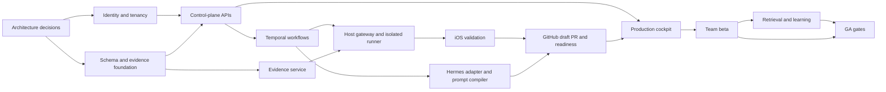

# Production Implementation Backlog

## 1. Purpose

This backlog converts `PRODUCTION_ENGINEERING_SPEC.md` into dependency-ordered,
verifiable engineering work. It supersedes neither the MVP backlog nor the
production specification:

- the MVP backlog proves one local task-to-draft-PR loop;
- this backlog hardens and expands that loop into the hosted, multi-tenant
  production system;
- the production specification remains authoritative for design intent and
  detailed requirements.

## 2. Priority and status conventions

| Priority | Meaning |
| --- | --- |
| P0 | Required to admit the first external team into the allowlisted, constrained beta |
| P1 | GA hardening, scale, accessibility, operations, or enterprise readiness that may be completed while the constrained beta is running |
| P2 | Controlled-expansion intake; not authorized or scheduled execution work |

Suggested task states are `NOT_STARTED`, `READY`, `IN_PROGRESS`, `BLOCKED`,
`IN_REVIEW`, and `DONE`.

Priority is a release gate, not a substitute for dependencies. P0 remains the
default for tenant isolation, authorization, secret handling, host isolation,
data/evidence integrity, exact-once external effects, cancellation, and the
minimum UX and operational controls needed to run a safe beta. A ticket may move
to P1 only when the beta can operate with the capability absent or explicitly
disabled, using pinned versions, strict repository/user/host allowlists, manual
onboarding, human merge, and operator supervision. `PROD-1406` is P1 because it
is the work of operating and learning from the beta, not a prerequisite for
admitting it.

The beta-admission gate is cohort-based: before the first external repository or
user is admitted, every P0 implementation/control ticket other than the pilot
execution ticket `PROD-1405` must be `DONE`, including `PROD-1404`. `PROD-1405`
then exercises that completed gate under the tighter alpha controls, and
`PROD-1406` cannot start until `PROD-1405` is `DONE`. A waiver requires an
explicit product and security decision that changes ticket scope or priority; a
priority label alone never waives a dependency.

`PROD-1405` is a supervised pre-beta design-partner alpha, not team beta: it is
limited to one trusted repository per partner, manual approval/merge, explicit
allowlists, and immediate operator stop. `PROD-1406` is the first team-beta
operation. GA-scale suites and qualification windows remain P1 even though
teams should start them during beta.

The main P1 deferrals are valid only with these beta constraints:

| Deferred capability | Constrained-beta control |
| --- | --- |
| Normalized review automation (`PROD-0907`–`PROD-0910`) | The system stops at an exact, verified draft PR; review and merge remain in GitHub and are fully human. |
| Aggregated inboxes, queue/admin/accessibility/notification/degraded UX hardening (`PROD-1005`–`PROD-1010`, `PROD-1012`) | Use the P0 task/brief/cockpit/inspector/cancellation surfaces, manual onboarding, operator support, and backend fail-safe modes; full WCAG qualification still gates GA. |
| Automatic host updater and release rings (`PROD-1108`, `PROD-1307`) | Run one signed/notarized, pinned host version; drain and replace it manually, and reject obsolete/revoked versions. |
| Full hostile/adversarial/supply-chain/release-suite qualification (`PROD-0510`, `PROD-1106`, `PROD-1107`, `PROD-1401`) | Each P0 boundary still passes its ticket-level abuse/isolation tests; section 27-scale consolidated suites gate GA. |
| Mixed-version migration hardening (`PROD-1303`) | Freeze schema/workflow versions during each beta cohort and use a reviewed drain/maintenance procedure for incompatible changes. |

Every task below includes:

- **Depends on:** work that must be complete or contractually stable first.
- **Outcome:** the concrete capability delivered.
- **Done when:** the acceptance test for closing the task.

### READY entry policy

Import may leave a ticket `NOT_STARTED` with owner and estimate unset. A ticket
may move to `READY` only when all of the following are recorded in Linear:

- one accountable **owner role** (for example, Control Plane, Host Platform,
  Security, or Product Operations), without inventing a named assignee;
- an estimate accepted by that role, or child-ticket decomposition when the
  work exceeds the team's ratified maximum single-ticket size;
- every prerequisite represented by an authoritative blocking link, with no
  missing ID or dependency cycle, and any contract-only dependency linked to
  the approved version;
- an executable acceptance test that identifies environment, fixture/input,
  expected result, and required evidence/verifier; and
- any external provisioning/procurement sub-issue already opened when it is on
  the delivery path.

If any item changes materially, the ticket returns to `NOT_STARTED` or
`BLOCKED`; merged code by itself does not make it `DONE`.

### Numeric threshold authority

Numeric launch gates come directly from `PRODUCTION_ENGINEERING_SPEC.md`
section 27 and must cite its subsection in the implementing ticket. A numeric
criterion not fixed by section 27 must cite a versioned ratification output from
an upstream decision ticket. `PROD-0006` owns the beta capacity/cost/operating
threshold registry, `PROD-0005` owns data-lifecycle values, `PROD-1101` owns
security-test parameters not fixed by section 27, and `PROD-1204` owns
SLO/error-budget windows. When a ratification output is the source, that ticket
must be an explicit or transitive dependency before `READY`. Implementers may
not silently tune a threshold to close a ticket.

## 3. Delivery phases

### Phase A — Architecture and platform foundation

Resolve production decisions, establish the repository and delivery standards,
implement identity/tenancy, and create authoritative persistence.

### Phase B — Secure hosted vertical slice

Deliver one hosted control plane connected to one isolated macOS execution host,
Hermes, one iOS validation contract, immutable evidence, and one GitHub App.

### Phase C — Team beta

Add multiple users, repositories, and hosts; production UX; audit, retention,
observability, backups, quotas, signed releases, and support operations.

### Phase D — General availability

Meet numeric security, reliability, quality, accessibility, recovery, and
operational launch gates for 30 consecutive days.

### Phase E — Controlled expansion

Add physical devices, broader providers, enterprise controls, and only
separately reviewed increases in autonomy.

## 4. Critical path

Security, observability, CI/CD, and recovery work begins with the foundation and
gates every later phase; it is not deferred cleanup.

## Epic 0 — Production decisions and governance

### PROD-0001 — Ratify the production deployment ADR

**Priority:** P0  
**Depends on:** None  
**Outcome:** Approved decision for hosted multi-tenant control plane,
single-region multi-AZ deployment, outbound macOS hosts, and no self-hosted GA.

**Done when:** The ADR names the cloud/primary region, managed PostgreSQL,
Temporal, object storage, Redis/event fan-out, deployment platform, and ownership
for every managed dependency.

### PROD-0002 — Ratify inference and Hermes data policy

**Priority:** P0  
**Depends on:** None  
**Outcome:** Approved choice of vendor-hosted, company-hosted, or local Hermes
and model inference for each repository classification.

**Done when:** Retention, training usage, subprocessors, egress, data region,
tenant isolation, provider fallback, and customer opt-out behavior are documented
and enforceable in configuration.

### PROD-0003 — Ratify the host execution and signing ADR

**Priority:** P0  
**Depends on:** None  
**Outcome:** Ephemeral macOS VM per task is the GA execution boundary;
persistent developer-account execution is explicitly beta-only.

**Done when:** The ADR defines VM provider/image ownership, network isolation,
credential boundary, teardown, supported Xcode matrix, and separate distribution
signing workflow.

### PROD-0004 — Ratify identity, tenant, and role model

**Priority:** P0  
**Depends on:** None  
**Outcome:** Organization → Workspace → Repository → Task hierarchy and scoped
roles are approved.

**Done when:** Human, service, host, GitHub, and workload principals plus role,
scope, separation-of-duties, step-up authentication, and revocation semantics
are documented.

### PROD-0005 — Ratify data classification and retention defaults

**Priority:** P0  
**Depends on:** PROD-0001, PROD-0002  
**Outcome:** Approved classes, prohibited data, retention, deletion, legal hold,
residency, backup lifetime, and object-lock policy.

**Done when:** Every planned record/artifact type maps to classification,
retention, encryption, upload/redaction, retrieval, and deletion behavior.

### PROD-0006 — Define launch capacity, operating thresholds, and commercial quotas

**Priority:** P0  
**Depends on:** PROD-0001  
**Outcome:** Ratified beta envelope, tenant limits, cost controls, and a
versioned registry for numeric operating criteria not fixed by production
specification section 27.

**Done when:** Limits exist for organizations, users, hosts, active tasks,
repository concurrency, model tokens/cost, host minutes, event rate, live
streams, artifact bytes, retention, and overage behavior; the registry records
source, scope, measurement method, owner role, approval, and supersession for
each value and explicitly adopts or revises the section 20.1 and 22.2 baselines.

### PROD-0007 — Establish architecture and security review ownership

**Priority:** P0  
**Depends on:** None  
**Outcome:** Named owners and required reviewers for authorization, host,
evidence, signing, workflow, prompt/policy, retention, and updater changes.

**Done when:** Code-owner and design-review rules are enforced in the repository
and include a documented exception/escalation path.

## Epic 1 — Repository, contracts, and engineering foundation

### PROD-0101 — Create the production monorepo structure

**Priority:** P0  
**Depends on:** PROD-0001  
**Outcome:** Deployable modules for web, control plane, workers, host gateway,
host agent, shared schemas/SDKs, infrastructure, and evaluation suites.

**Done when:** A clean checkout boots local dependencies and passes baseline
format, lint, type, unit, and generated-client checks.

### PROD-0102 — Establish language and dependency policy

**Priority:** P0  
**Depends on:** PROD-0101  
**Outcome:** Pinned runtime/toolchain versions and locked dependency workflows
for TypeScript, Python, Swift, containers, and CI actions.

**Done when:** Reproducible installs work in CI; dependency, license, and secret
scans fail builds according to documented severity policy.

### PROD-0103 — Define OpenAPI conventions and generation

**Priority:** P0  
**Depends on:** PROD-0101  
**Outcome:** Versioned REST conventions, problem errors, opaque UUIDv7 IDs,
cursor pagination, idempotency, optimistic concurrency, and generated clients.

**Done when:** A sample resource generates compatible TypeScript/Python clients
and contract tests detect backward-incompatible schema changes.

### PROD-0104 — Define domain event schemas and registry

**Priority:** P0  
**Depends on:** PROD-0101  
**Outcome:** Versioned event envelope and compatibility/upcasting rules.

**Done when:** Schema validation covers event ID, tenant, task sequence,
correlation, causation, actor, timestamps, payload, and evidence references;
consumer compatibility tests run in CI.

### PROD-0105 — Define host protobuf protocol

**Priority:** P0  
**Depends on:** PROD-0003, PROD-0101  
**Outcome:** Versioned bidirectional gRPC protocol for enrollment, heartbeat,
capability, job offer, progress, cancellation, and result.

**Done when:** Generated Swift/Python clients interoperate; version negotiation,
unknown messages, duplicate delivery, and reconnect replay are contract-tested.

### PROD-0106 — Define evidence envelope and canonicalization package

**Priority:** P0  
**Depends on:** PROD-0101, PROD-0005  
**Outcome:** Domain-neutral RFC 8785 canonical JSON, SHA-256 hashing, lineage,
classification, retention, and verification schemas inspired by Pine mechanics.

**Done when:** Cross-language fixtures produce identical hashes; malformed,
noncanonical, cross-tenant, and tampered envelopes fail deterministic tests.

### PROD-0107 — Establish configuration and feature-flag contracts

**Priority:** P0  
**Depends on:** PROD-0101  
**Outcome:** Typed environment, tenant, repository, host, model, validation,
retention, and kill-switch configuration.

**Done when:** Configuration validates at startup, secrets are references rather
than values, flags cannot bypass authorization, and every flag has owner/expiry.

## Epic 2 — Identity, tenancy, and authorization

### PROD-0201 — Integrate OIDC authentication

**Priority:** P0  
**Depends on:** PROD-0004, PROD-0103  
**Outcome:** Secure human login and browser sessions.

**Done when:** Sessions use secure HTTP-only SameSite cookies, CSRF defense,
rotation, logout/revocation, MFA through the IdP, and step-up for sensitive
approvals.

### PROD-0202 — Implement organization and workspace lifecycle

**Priority:** P0  
**Depends on:** PROD-0201, PROD-0301  
**Outcome:** Authorized organization/workspace creation, membership, suspension,
and offboarding.

**Done when:** Lifecycle operations are idempotent, audited, and isolation tests
prove one organization cannot enumerate another.

### PROD-0203 — Implement principals and scoped role bindings

**Priority:** P0  
**Depends on:** PROD-0201, PROD-0301  
**Outcome:** Human, service, host, GitHub, and internal workload identities with
organization/workspace/repository/task-scoped roles.

**Done when:** The authorization matrix covers every API/resource/action and
supports users with multiple roles and scopes.

### PROD-0204 — Implement centralized policy enforcement

**Priority:** P0  
**Depends on:** PROD-0203  
**Outcome:** Deny-by-default server-side RBAC/ABAC outside Hermes.

**Done when:** Every API, SSE stream, artifact URL, retrieval query, background
job, host command, and approval passes the same versioned authorization layer.

### PROD-0205 — Implement PostgreSQL row-level security

**Priority:** P0  
**Depends on:** PROD-0301, PROD-0203  
**Outcome:** Database-level tenant isolation and composite scoped foreign keys.

**Done when:** Automated cross-tenant reads/writes fail across all tenant-owned
tables using application and migration roles.

### PROD-0206 — Implement service/workload identity

**Priority:** P0  
**Depends on:** PROD-0203, PROD-1101, PROD-1102  
**Outcome:** Rotatable workload identities for API, workflow, workers, evidence,
host gateway, and adapters.

**Done when:** No service depends on a long-lived shared secret and revocation
takes effect within the `PROD-1101`-ratified security window (the production
specification section 8.2 five-minute baseline unless explicitly tightened).

### PROD-0207 — Implement separation of duties

**Priority:** P1  
**Depends on:** PROD-0204, PROD-0405  
**Outcome:** Proposers cannot self-approve organization rules, signing, or
release-sensitive actions.

**Done when:** Two-person organization-wide rule approval and step-up
authentication are enforced and tested under concurrent decisions.

### PROD-0208 — Add SAML/SCIM enterprise provisioning

**Priority:** P2  
**Depends on:** PROD-0201, PROD-0202  
**Outcome:** Enterprise identity and joiner/mover/leaver automation.

**Done when:** Provisioning, deprovisioning, group-to-role mapping, audit, and
session revocation pass provider contract tests.

## Epic 3 — Authoritative data and storage

### PROD-0301 — Implement the foundational PostgreSQL schema

**Priority:** P0  
**Depends on:** PROD-0004, PROD-0101  
**Outcome:** Migrations for tenants, workspaces, principals, repositories, hosts,
tasks, revisions, briefs, criteria, and configuration versions.

**Done when:** Migrations are forward-only, repeatable, tenant-aware, and pass
fresh-install plus upgrade tests.

### PROD-0302 — Implement task and workflow persistence

**Priority:** P0  
**Depends on:** PROD-0301, PROD-0104  
**Outcome:** Current task state plus append-only transitions, task events,
workflow runs, steps, attempts, generations, and host operations.

**Done when:** Optimistic state version, sequence uniqueness, cancellation
generation, and stale-result rejection pass property tests.

### PROD-0303 — Implement approval and policy persistence

**Priority:** P0  
**Depends on:** PROD-0301  
**Outcome:** Approval requests, exact evidence snapshots, decisions, policy
bundles, rule candidates, rule versions, supersession, and revocation.

**Done when:** Material scope/diff/policy/evidence changes invalidate approval;
concurrent decisions cannot both win.

### PROD-0304 — Implement GitHub and validation persistence

**Priority:** P0  
**Depends on:** PROD-0301  
**Outcome:** Installations, PRs, checks, review threads/comments, deliveries,
validation contracts/runs/assertions, and environment fingerprints.

**Done when:** Provider IDs are scoped/unique and head-SHA changes invalidate
stale readiness deterministically.

### PROD-0305 — Implement Evidence Ledger persistence

**Priority:** P0  
**Depends on:** PROD-0106, PROD-0301  
**Outcome:** Source records, edges, artifacts/chunks, manifests, attestations,
verification/quarantine, checkpoints, and retention holds.

**Done when:** Authoritative evidence fields are append-only, all relationships
are tenant-scoped join tables, and integrity tests detect tampering.

### PROD-0306 — Implement retrieval and evaluation persistence

**Priority:** P1  
**Depends on:** PROD-0305  
**Outcome:** Derived knowledge/citations, retrieval chunks/sets/items/outcomes,
prompt executions, and index generations.

**Done when:** Source spans/hashes and derivation/index/ACL/verifier versions are
queryable; cross-tenant relations are impossible by constraint.

### PROD-0307 — Implement idempotency, inbox, outbox, and reconciliation tables

**Priority:** P0  
**Depends on:** PROD-0301  
**Outcome:** Durable at-least-once processing primitives.

**Done when:** Stored responses, inbox deduplication, outbox lease/retry, and
reconciliation cursors pass duplicate, reorder, crash, and replay tests.

### PROD-0308 — Provision managed PostgreSQL

**Priority:** P0  
**Depends on:** PROD-0001, PROD-0006, PROD-1201  
**Outcome:** Multi-AZ encrypted PostgreSQL with pooling, PITR, monitoring, and
isolated environment databases.

**Done when:** Failover and restore tests meet the `PROD-0006` registry's
adoption of section 20.1: zero acknowledged-transition loss for AZ failover and
the ratified regional RPO target.

### PROD-0309 — Provision immutable object storage

**Priority:** P0  
**Depends on:** PROD-0001, PROD-0005, PROD-1201  
**Outcome:** Tenant-scoped, KMS-encrypted, versioned artifact storage with
retention classes, lifecycle, direct uploads, and cross-region backup.

**Done when:** Hash verification, Object Lock, crypto-erasure, legal hold,
short-lived download, and restore tests pass.

## Epic 4 — Control plane, workflow, approvals, and events

### PROD-0401 — Implement task command API

**Priority:** P0  
**Depends on:** PROD-0103, PROD-0204, PROD-0302, PROD-0307  
**Outcome:** Create, message/steer, pause, resume, cancel, and read task APIs.

**Done when:** Every mutation authorizes, checks expected version, uses an
idempotency key, commits state/events/outbox atomically, and returns replay-safe
responses.

### PROD-0402 — Implement deterministic transition guards

**Priority:** P0  
**Depends on:** PROD-0302  
**Outcome:** The canonical production state machine including PR_ACTIVE,
revalidation, handoff, merge, delivery, pause, escalation, and cancellation.

**Done when:** Model-based tests cover every legal/illegal transition,
precondition, timeout, resumption, external head change, and terminal state.

### PROD-0403 — Integrate Temporal

**Priority:** P0  
**Depends on:** PROD-0001, PROD-0307, PROD-0401  
**Outcome:** Durable workflow execution, timers, retries, signals, and
cancellation while PostgreSQL remains domain authority.

**Done when:** PostgreSQL/Temporal outbox, command idempotency, ambiguous-write
reconciliation, worker crash replay, and workflow versioning pass fault tests.

### PROD-0404 — Implement task event replay and SSE

**Priority:** P0  
**Depends on:** PROD-0302, PROD-0401  
**Outcome:** Durable timeline replay followed by live events.

**Done when:** `Last-Event-ID`, cursor replay, duplicate suppression, reconnect
storms, authorization revocation, and slow consumers pass load/contract tests.

### PROD-0405 — Implement the approval service

**Priority:** P0  
**Depends on:** PROD-0303, PROD-0402, PROD-0204  
**Outcome:** Brief, scope, unsafe action, repeated failure, review conflict,
signing, and rule approval workflows.

**Done when:** Requests bind exact hashes/versions, expire closed, invalidate on
material change, support revise/reject/defer, and create immutable audit.

### PROD-0406 — Implement workflow reconciliation

**Priority:** P0  
**Depends on:** PROD-0403, PROD-0307  
**Outcome:** Repair missing Temporal signals, stale leases, orphan operations,
and domain/workflow drift without inferring product truth from Temporal.

**Done when:** Injected DB, dispatcher, worker, and provider failures converge to
one correct state with no duplicate external effect.

### PROD-0407 — Implement operator controls

**Priority:** P1  
**Depends on:** PROD-0403, PROD-0406, PROD-1006  
**Outcome:** Audited pause, cancel, resume, drain, reconcile, and bounded replay
without direct database edits.

**Done when:** Each control explains impact, checks authorization, records actor
and reason, and passes race-condition tests.

## Epic 5 — macOS host gateway, agent, and isolation

### PROD-0501 — Implement host enrollment and device identity

**Priority:** P0  
**Depends on:** PROD-0105, PROD-0206, PROD-0301  
**Outcome:** One-time enrollment and rotatable host device certificates.

**Done when:** Host binds to one environment/workspace; certificate rotation,
expiry, revocation, and five-minute access cutoff pass tests.

### PROD-0502 — Implement the outbound gRPC host gateway

**Priority:** P0  
**Depends on:** PROD-0105, PROD-0501  
**Outcome:** Scalable bidirectional mTLS sessions, heartbeat, capability
inventory, signed job delivery, progress, cancellation, and results.

**Done when:** Duplicate/out-of-order frames, reconnect, backpressure, gateway
restart, protocol downgrade, and revoked-host behavior pass.

### PROD-0503 — Implement capability and job authorization

**Priority:** P0  
**Depends on:** PROD-0204, PROD-0502, PROD-0302  
**Outcome:** Short-lived task/repository/state/operation/policy-bound capability
tokens and fencing.

**Done when:** Stale, replayed, cross-task, cross-repository, expired, revoked,
or wrong-state operations are independently rejected by gateway and host.

### PROD-0504 — Build the signed/notarized host agent

**Priority:** P0  
**Depends on:** PROD-0105, PROD-0502  
**Outcome:** Non-root launchd service with verified identity, operation journal,
process supervision, metrics, pinned-version enforcement, and a manual
upgrade/revocation path for constrained beta.

**Done when:** Signed/notarized install, health, reconnect, drain, minimum
version rejection, manual replacement, and emergency revoke pass staging tests.
Automatic update rings and rollback are delivered by `PROD-1108`.

### PROD-0505 — Implement workspace read/search operations

**Priority:** P0  
**Depends on:** PROD-0503, PROD-0504  
**Outcome:** Bounded file listing/read/search/status/diff APIs for Hermes.

**Done when:** Path, symlink, hard-link, result-size, encoding, binary, and
workspace-ownership adversarial tests pass without arbitrary expressions.

### PROD-0506 — Implement workspace lifecycle and bootstrap

**Priority:** P0  
**Depends on:** PROD-0504, PROD-0304  
**Outcome:** Deterministic task workspace, temporary home/caches/DerivedData,
named bootstrap recipe, cleanup, and environment fingerprint.

**Done when:** Creation/cleanup are idempotent, cannot affect unowned paths, and
ambiguous reconnects reconcile from the durable operation journal.

### PROD-0507 — Implement Git mutation operations

**Priority:** P0  
**Depends on:** PROD-0505, PROD-0506  
**Outcome:** Typed fetch, patch, status, diff, commit, and task-branch push.

**Done when:** Push uses an ephemeral GitHub credential helper; branch/refspec,
repository, head, author, and prohibited-path policies are verified and no
credential appears in output.

### PROD-0508 — Implement build/test/simulator/log operations

**Priority:** P0  
**Depends on:** PROD-0506  
**Outcome:** Typed Xcode build/test, simulator preparation/flow, log capture, and
artifact upload operations.

**Done when:** Fixed executable paths, argument schemas, resource limits,
timeouts, full process-tree cancellation, partial evidence, and operation hashes
pass contract and failure tests.

### PROD-0509 — Provision ephemeral macOS VM execution

**Priority:** P0  
**Depends on:** PROD-0003, PROD-0504, PROD-1201  
**Outcome:** Signed hardened VM image and per-task lifecycle with default-deny
egress and no developer-login secrets.

**Done when:** VM provisioning/teardown, clean-state proof, task-only credential
injection, egress grants, disk/resource limits, and artifact egress are automated.

### PROD-0510 — Pass the hostile-build isolation suite

**Priority:** P1  
**Depends on:** PROD-0508, PROD-0509, PROD-1106  
**Outcome:** Demonstrated containment of malicious Xcode/package/test scripts.

**Done when:** The production-specification section 27.2 gate passes: at least
100 malicious fixtures produce zero denied secret/file reads, zero workspace
escape, zero login-Keychain access, and zero unapproved egress.

### PROD-0511 — Design privileged device/distribution signing

**Priority:** P2  
**Depends on:** PROD-0509, PROD-1101  
**Outcome:** Separate approved capability/service for physical device or
distribution signing.

**Done when:** Private keys never enter normal tasks; entitlement, approval,
audit, revocation, and incident controls pass an independent security review.

## Epic 6 — Hermes, prompts, tools, and governed agent execution

### PROD-0601 — Build the versioned Hermes adapter

**Priority:** P0  
**Depends on:** PROD-0403, PROD-0103  
**Outcome:** Start, stream, inspect, cancel, and reconcile Hermes runs.

**Done when:** Stable `(tenant, task, role, generation)` idempotency prevents
duplicate starts and ambiguous responses reconcile exactly one active run.

### PROD-0602 — Implement Hermes tenant/session isolation

**Priority:** P0  
**Depends on:** PROD-0002, PROD-0601, PROD-0204  
**Outcome:** Isolated profiles, sessions, memory, skills, caches, and retention
by tenant/workspace.

**Done when:** Cross-tenant session search/cache tests return zero leakage and
unsupported Hermes versions fail closed.

### PROD-0603 — Broker Hermes approvals

**Priority:** P0  
**Depends on:** PROD-0405, PROD-0601  
**Outcome:** Hermes pauses create control-plane approvals; only authoritative
decisions resume operations.

**Done when:** Hermes cannot self-approve, bypass expiry, or resume after
scope/evidence invalidation.

### PROD-0604 — Implement the tool gateway

**Priority:** P0  
**Depends on:** PROD-0503, PROD-0601, PROD-0204  
**Outcome:** Every tool call is bound to role, task state, repository, policy,
operation schema, capability, budget, and correlation record.

**Done when:** Hermes has no direct host/GitHub/secret/database access and
adversarial tool arguments cannot expand scope or egress.

### PROD-0605 — Implement structured prompt compiler

**Priority:** P0  
**Depends on:** PROD-0106, PROD-0303, PROD-0601  
**Outcome:** Versioned planner, implementer, validator, PR writer, review
resolver, and independent-review prompts.

**Done when:** Prompt inputs are approved state plus verified retrieval; secrets
and unbounded logs are excluded; prompt/input/version hashes are recorded.

### PROD-0606 — Implement structured role outputs

**Priority:** P0  
**Depends on:** PROD-0605  
**Outcome:** Validated schemas for plans, repair intent, review classification,
PR content, validation analysis, and rule candidates.

**Done when:** Invalid output receives one constrained retry then deterministic
fallback/escalation; prose cannot transition tasks.

### PROD-0607 — Enforce memory and skill-write governance

**Priority:** P0  
**Depends on:** PROD-0405, PROD-0602  
**Outcome:** Delivery runs use approved read-only skills; memory/skill proposals
enter the Rule/Skill Inbox.

**Done when:** Retrieved or repository content cannot silently change Hermes
memory, skills, system instructions, permissions, or policy.

### PROD-0608 — Add model budgets and provider circuit breakers

**Priority:** P0  
**Depends on:** PROD-0601, PROD-0006  
**Outcome:** Per-task/tenant token, cost, time, concurrency, and fallback policy.

**Done when:** Budget exhaustion pauses/escalates safely; outages do not consume
repair budget or silently change model/policy.

## Epic 7 — Evidence, retrieval, evaluation, and controlled learning

### PROD-0701 — Implement two-phase artifact publication

**Priority:** P0  
**Depends on:** PROD-0305, PROD-0309  
**Outcome:** Temporary presigned upload, redaction/size/hash verification,
trusted finalization, and orphan cleanup.

**Done when:** Object-only success is not evidence; interrupted, duplicate,
tampered, and DB-failure scenarios reconcile without lost or false records.

### PROD-0702 — Implement evidence verification and quarantine

**Priority:** P0  
**Depends on:** PROD-0701, PROD-0106  
**Outcome:** `UPLOADING -> RECEIVED -> HASH_VERIFIED -> PARSED -> TRUSTED`
pipeline with quarantine/rejection/tombstone states.

**Done when:** Only trusted evidence can satisfy completion or enter the
high-trust index; parser failure never changes raw hashes.

### PROD-0703 — Implement signed integrity checkpoints

**Priority:** P1  
**Depends on:** PROD-0305, PROD-1101, PROD-1102  
**Outcome:** KMS-signed hash-chain/Merkle checkpoints anchored outside the
primary database.

**Done when:** Checkpoint cadence is ratified by `PROD-1101` (daily baseline)
and read/promotion verification detects database/object tampering and produces
tenant-safe audit proof.

### PROD-0704 — Implement redaction and DLP pipeline

**Priority:** P0  
**Depends on:** PROD-0005, PROD-0701  
**Outcome:** Source-side and service-side scanning of prompts, diffs, logs,
screenshots, network captures, artifacts, and PR content.

**Done when:** Known secrets are blocked/redacted, uncertain content is
quarantined, and raw sensitive data never enters general telemetry.

### PROD-0705 — Implement lexical and pgvector indexing

**Priority:** P1  
**Depends on:** PROD-0306, PROD-0702  
**Outcome:** Verified-only hybrid retrieval with tenant/workspace/repository/
classification/ACL/freshness filters.

**Done when:** Index can be deleted/rebuilt from source evidence; revoked,
tombstoned, stale, quarantined, or unauthorized records never appear.

### PROD-0706 — Implement frozen RetrievalSets

**Priority:** P1  
**Depends on:** PROD-0705  
**Outcome:** Persisted ranked chunks, hashes, source spans, scores, index/
reranker/ACL/verifier/policy versions, and token estimate for every run.

**Done when:** Any agent context can be reproduced and citation authorization is
revalidated at read time.

### PROD-0707 — Implement multi-resolution derived knowledge

**Priority:** P1  
**Depends on:** PROD-0706  
**Outcome:** Versioned summaries and patterns that cite exact authorized source
spans and expand summary-to-source when risk/uncertainty requires.

**Done when:** Derivation model/prompt/tool versions are stored and deletion or
source revocation supersedes dependent knowledge within the `PROD-0005`-ratified
lifecycle window (24-hour baseline).

### PROD-0708 — Build retrieval/prompt evaluation harness

**Priority:** P1  
**Depends on:** PROD-0706, PROD-0605  
**Outcome:** Frozen representative tasks measure citations, relevance, leakage,
task outcome, repair count, tokens, latency, and noise.

**Done when:** Version comparisons and canary promotion enforce numeric
regression thresholds and zero-tolerance ACL leakage.

### PROD-0709 — Implement Rule Inbox eligibility and decisions

**Priority:** P1  
**Depends on:** PROD-0303, PROD-0607, PROD-0707, PROD-0708  
**Outcome:** Evidence-backed candidates, evaluation, human approval, ownership,
scope, review/expiry, versioning, supersession, and revocation.

**Done when:** Eligibility requires one confirmed high-severity or two
independent confirmed occurrences; rejected candidates train noise evaluation;
no policy auto-promotes.

### PROD-0710 — Run learning in shadow mode

**Priority:** P1  
**Depends on:** PROD-0708, PROD-0709  
**Outcome:** Retrieval and rule candidates compared against human outcomes
without affecting production behavior.

**Done when:** Shadow metrics meet launch thresholds for citation correctness,
leakage, usefulness, token efficiency, and false-positive rate.

## Epic 8 — iOS repository configuration and validation

### PROD-0801 — Define typed repository configuration schema

**Priority:** P0  
**Depends on:** PROD-0107, PROD-0304  
**Outcome:** Versioned project/workspace, schemes, destinations, bootstrap,
operations, fixtures, prohibited paths, egress, artifact, and timeout policy.

**Done when:** Invalid/missing configuration blocks execution and a signed
configuration diff requires approval before mutation.

### PROD-0802 — Define typed validation assertion schemas

**Priority:** P0  
**Depends on:** PROD-0801  
**Outcome:** Build/test, UI, visual, log, crash, network, performance, and
data/state assertions with deterministic thresholds.

**Done when:** Every assertion names verifier, environment, baseline, repetitions,
tolerance, artifacts, required status, and failure classification.

### PROD-0803 — Implement environment fingerprinting

**Priority:** P0  
**Depends on:** PROD-0508, PROD-0801  
**Outcome:** Host-agent, macOS, Xcode, SDK/runtime, simulator, dependencies,
revision, scheme, locale/timezone, fixture, and contract identity.

**Done when:** Every validation run has one immutable fingerprint and incompatible
environment changes invalidate comparison.

### PROD-0804 — Implement fixture/test-account provisioning

**Priority:** P0  
**Depends on:** PROD-0509, PROD-0801, PROD-1102  
**Outcome:** Versioned synthetic fixtures and short-lived test credentials.

**Done when:** Secrets exist only in the VM, are redacted from artifacts, and are
destroyed at teardown; provisioning is idempotent and auditable.

### PROD-0805 — Implement deterministic validation verifiers

**Priority:** P0  
**Depends on:** PROD-0802, PROD-0508, PROD-0702  
**Outcome:** Non-model code produces criterion-level PASS/FAIL/BLOCKED/
NOT_APPLICABLE results.

**Done when:** Missing/corrupt evidence fails closed and a model cannot override
a deterministic failure.

### PROD-0806 — Implement failure classification and rerun policy

**Priority:** P0  
**Depends on:** PROD-0805  
**Outcome:** Product defect, test defect, infrastructure, flake, policy, and
unknown classes drive distinct behavior.

**Done when:** Infrastructure/flake handling never prompts code repair; flake
repetition/statistical thresholds and escalation are contract-tested.

### PROD-0807 — Implement bounded repair orchestration

**Priority:** P0  
**Depends on:** PROD-0606, PROD-0806, PROD-0403  
**Outcome:** Evidence-backed novel repair attempts and revalidation.

**Done when:** Per-class time/token/retry budgets, equivalent failure detection,
attempt comparison, stale-revision protection, and escalation pass golden tests.

### PROD-0808 — Build the reference iOS repository and golden flows

**Priority:** P0  
**Depends on:** PROD-0802, PROD-0508  
**Outcome:** Maintained reference app with deterministic success and injected
failure scenarios.

**Done when:** CI/staging covers normal success, product defect, test defect,
flake, Xcode hang, simulator crash, host loss, malicious build, and incomplete
evidence.

### PROD-0809 — Define production-like environment profile

**Priority:** P0  
**Depends on:** PROD-0801, PROD-0005  
**Outcome:** Production-equivalent compilation with test backend/fixtures and no
production endpoint, analytics, data, remote config, or release signing.

**Done when:** Any production-sensitive difference requires a separately
versioned profile, threat review, and explicit approval.

## Epic 9 — GitHub App, PR, CI, and review

### PROD-0901 — Register environment-specific GitHub Apps

**Priority:** P0  
**Depends on:** PROD-0001, PROD-1102  
**Outcome:** Separate dev/staging/prod Apps with installation-scoped least
privilege and isolated webhook secrets.

**Done when:** Merge/admin/secrets/environment/workflow-file-write permissions
are absent and permission snapshots are audited.

### PROD-0902 — Implement installation and repository onboarding

**Priority:** P0  
**Depends on:** PROD-0204, PROD-0901, PROD-0304, PROD-1101  
**Outcome:** Install/connect/select repositories and reconcile grants.

**Done when:** Revoked installations/repositories lose access within the
`PROD-1101`-ratified security window (the section 8.2 five-minute baseline) and
onboarding cannot enumerate ungranted repositories.

### PROD-0903 — Implement webhook inbox

**Priority:** P0  
**Depends on:** PROD-0901, PROD-0307  
**Outcome:** Signed, replay-protected, idempotent durable receipt for required
GitHub events.

**Done when:** Signature, timestamp, installation, repository, delivery ID,
payload size, duplicate, reorder, and unsupported-event tests pass.

### PROD-0904 — Implement periodic GitHub reconciliation

**Priority:** P0  
**Depends on:** PROD-0006, PROD-0902, PROD-0903  
**Outcome:** Active PR/check/review state converges despite lost webhooks or
ambiguous API failures.

**Done when:** Active incomplete PRs reconcile within the `PROD-0006` registry's
adoption of the section 17.2 five-minute baseline, and drift creates attributable
events without duplicate effects.

### PROD-0905 — Implement idempotent branch push and draft PR creation

**Priority:** P0  
**Depends on:** PROD-0507, PROD-0902, PROD-0403  
**Outcome:** One deterministic task branch and one draft PR per delivery
generation.

**Done when:** Retry/crash/reconnect tests create no duplicate branch or PR and
the PR head exactly matches validated revision.

### PROD-0906 — Implement check/ruleset readiness

**Priority:** P0  
**Depends on:** PROD-0904, PROD-0304  
**Outcome:** Required checks derived from branch rulesets plus versioned
repository policy.

**Done when:** Head or policy changes invalidate readiness; CI/review conditions
can arrive concurrently in PR_ACTIVE.

### PROD-0907 — Implement normalized review threads/comments

**Priority:** P1  
**Depends on:** PROD-0904  
**Outcome:** Reviews, conversation comments, inline threads/replies, anchors,
edit snapshots, authors, SHAs, and resolution state.

**Done when:** Edited, deleted, stale-anchor, duplicate, and out-of-order comment
fixtures reconcile without losing original evidence.

### PROD-0908 — Implement review classification and approval

**Priority:** P1  
**Depends on:** PROD-0606, PROD-0907, PROD-0405  
**Outcome:** Actionable, informational, conflicting, speculative, and
scope-expanding classifications with policy-based approvals.

**Done when:** Only low-risk in-scope feedback can auto-enter repair; all other
classes request approval bound to current head and proposed repair scope.

### PROD-0909 — Implement review response and revalidation

**Priority:** P1  
**Depends on:** PROD-0807, PROD-0908, PROD-0905  
**Outcome:** Repair, commit/push, reply, optional re-review request, thread
resolution after verification, and return to PR_ACTIVE.

**Done when:** New head invalidates old evidence, required validation reruns,
responses are attributable/idempotent, and stale anchors remain traceable.

### PROD-0910 — Implement merge/delivery reconciliation

**Priority:** P1  
**Depends on:** PROD-0904, PROD-0906  
**Outcome:** Distinct READY_FOR_HUMAN_MERGE, HANDED_OFF, MERGED, and DELIVERED
states.

**Done when:** Human GitHub merge reconciles the exact approved head; no automatic
merge or release capability exists in initial GA.

## Epic 10 — Production web application and UX

### PROD-1001 — Build authenticated application shell

**Priority:** P0  
**Depends on:** PROD-0201, PROD-0103  
**Outcome:** Navigation for Work, Approvals, Rules, Repositories, Hosts,
Evaluations/Audit, and Administration.

**Done when:** Route/data authorization, session expiry, responsive layout,
keyboard navigation, and error/degraded states pass browser tests.

### PROD-1002 — Build task creation and brief approval flow

**Priority:** P0  
**Depends on:** PROD-0401, PROD-0405, PROD-0605  
**Outcome:** Request, repository/base, structured brief, version diff, criteria,
risk, validation plan, unresolved questions, and approval.

**Done when:** Users can edit/review without reconstructing chat and can see
exactly what their approval authorizes.

### PROD-1003 — Build the production task cockpit

**Priority:** P0  
**Depends on:** PROD-0006, PROD-0404, PROD-0304, PROD-0701  
**Outcome:** Persistent timeline, state/next action, host/run, budget/retries,
scope, criteria, readable activity, approvals, chat, and inspector tabs.

**Done when:** In moderated tests, users identify state, blocker, evidence, and
next action without opening raw logs and within the usability target ratified in
the `PROD-0006` registry (ten-second baseline).

### PROD-1004 — Build evidence, validation, diff, logs, and PR inspectors

**Priority:** P0  
**Depends on:** PROD-1003, PROD-0805, PROD-0905, PROD-0906  
**Outcome:** Authorized artifact access, search, criterion links, environment,
attempt comparison, draft-PR/readiness state, and raw-detail expansion.
Normalized review-thread inspection is delivered with `PROD-0907`.

**Done when:** Raw content stays collapsed, access/redaction is enforced, and
stale evidence/revision relationships are obvious.

### PROD-1005 — Build Approval and Rule Inboxes

**Priority:** P1  
**Depends on:** PROD-0405, PROD-0709  
**Outcome:** Actionable decisions with context, evidence, risk, expiry, owner,
version diff, impact, and approve/revise/reject/defer/supersede/revoke actions.

**Done when:** Concurrent decisions, expiration, invalidation, two-person rules,
and deep links pass E2E tests.

### PROD-1006 — Build repository and host administration

**Priority:** P1  
**Depends on:** PROD-0502, PROD-0801, PROD-0902  
**Outcome:** GitHub grants, validation config, branches, hosts, capabilities,
version, active work, drain/update/revoke, and readiness checks.

**Done when:** A repository and Mac can be onboarded without shell/DB access and
the signed configuration summary is visible before enabling mutation.

### PROD-1007 — Build organization administration and audit

**Priority:** P1  
**Depends on:** PROD-0203, PROD-1103  
**Outcome:** Members/roles, providers/budgets, retention, notifications, flags,
audit search/export, and time-bound support access.

**Done when:** Every admin mutation is authorized/audited and support cannot
silently impersonate a user.

### PROD-1008 — Implement accessible live behavior

**Priority:** P1  
**Depends on:** PROD-1003  
**Outcome:** WCAG 2.2 AA cockpit, diffs, logs, timeline, dialogs, and virtualized
lists.

**Done when:** Automated axe has no critical/serious issues and keyboard-only,
VoiceOver, 200% zoom, high contrast, reduced motion, paused autoscroll, and
controlled live-region tests pass, satisfying the section 27.4 WCAG 2.2 AA gate.

### PROD-1009 — Implement notifications

**Priority:** P1  
**Depends on:** PROD-0404, PROD-0204  
**Outcome:** In-app/email actionable notifications with threading,
deduplication, preferences, quiet hours, defer/snooze, and acknowledgement.

**Done when:** Messages deep-link to authorized decisions and never include
source, secrets, or raw logs.

### PROD-1010 — Build task queue and saved operational views

**Priority:** P1  
**Depends on:** PROD-0404, PROD-1001  
**Outcome:** Users can find work by repository, owner, state, blocker, risk,
staleness, and required action without opening each task.

**Done when:** Filters and saved views survive reconnect/session changes,
action-required and stale tasks are unambiguous, and cursor replay never
duplicates, hides, or reorders the projected task state.

### PROD-1011 — Build execution steering, pause, and cancellation UX

**Priority:** P0  
**Depends on:** PROD-0401, PROD-0403, PROD-1003  
**Outcome:** Users can steer, pause, resume, or cancel work with a clear account
of when the command takes effect.

**Done when:** Requested and confirmed states are distinct, safe-boundary
behavior is explained, destructive actions require confirmation, and a late
generation/result can never visually reactivate cancelled or superseded work.

### PROD-1012 — Build dependency-specific offline and degraded UX

**Priority:** P1  
**Depends on:** PROD-1003, PROD-1206  
**Outcome:** Host, Hermes, GitHub, retrieval, and control-plane degradation are
shown as distinct safe states with an actionable next step.

**Done when:** Fault-injection browser tests preserve authorized durable history,
never claim completion/cancellation without confirmation, and show whether retry,
reconnect, read-only operation, or human intervention is available.

### PROD-1013 — Add Slack/Teams notifications

**Priority:** P2  
**Depends on:** PROD-1009  
**Outcome:** Optional team notification connectors.

**Done when:** Permission, tenant isolation, revocation, threading, and content
minimization pass connector review.

## Epic 11 — Security, privacy, evidence integrity, and supply chain

### PROD-1101 — Complete the production threat model

**Priority:** P0  
**Depends on:** PROD-0001, PROD-0002, PROD-0003, PROD-0004, PROD-0005  
**Outcome:** Reviewed data flows, trust boundaries, assets, abuse cases, and
controls for browser, control plane, Hermes, GitHub, host, build content,
evidence, retrieval, and insiders.

**Done when:** Every high-risk threat has implemented owner/control/test or an
approved time-bounded exception.

### PROD-1102 — Implement KMS and secret management

**Priority:** P0  
**Depends on:** PROD-0001, PROD-0005  
**Outcome:** Workload identity, managed secrets, envelope encryption, rotation,
revocation, and environment/tenant key context.

**Done when:** No persistent PAT/shared token exists; model/GitHub/provider keys
never enter prompts or host output; rotation and compromise drills pass.

### PROD-1103 — Implement immutable security audit

**Priority:** P0  
**Depends on:** PROD-0305, PROD-0309, PROD-0204  
**Outcome:** Separate append-only audit for auth, authorization, config, hosts,
approvals, rules, evidence access/export/deletion, credentials, support, and
recovery.

**Done when:** Tenant-safe export, integrity verification, clock monitoring, and
admin/key/retention change alerts pass.

### PROD-1104 — Implement retention, legal hold, deletion, and export

**Priority:** P1  
**Depends on:** PROD-0005, PROD-0309, PROD-0305, PROD-0707  
**Outcome:** Tenant-configurable retention and full data lifecycle.

**Done when:** Eligible content/index deletion or crypto-erasure completes within
the `PROD-0005`-ratified lifecycle window (24-hour baseline); holds override
deletion; restored backups reapply tombstones; dependent knowledge disappears.

### PROD-1105 — Implement prompt-injection and knowledge-poisoning defenses

**Priority:** P0  
**Depends on:** PROD-0604, PROD-0702  
**Outcome:** Trusted policy, structured task state, and untrusted evidence are
isolated; retrieved/repository/review content cannot authorize.

**Done when:** Adversarial issue, source, log, network, review, memory, and tool
arguments cannot expand capabilities, leak scope, change policy, or mutate
externally without independent authorization.

### PROD-1106 — Build security adversarial suites

**Priority:** P1  
**Depends on:** PROD-1101  
**Outcome:** Automated tenant, host, webhook, prompt, retrieval, tool, egress,
secret, path, and cancellation attacks.

**Done when:** Suites run in CI/staging and enforce zero cross-tenant leakage,
zero unauthorized mutation, and host sandbox thresholds.

### PROD-1107 — Establish secure supply-chain pipeline

**Priority:** P1  
**Depends on:** PROD-0102, PROD-1301  
**Outcome:** Locked/digest-pinned dependencies and CI, SAST, secrets, licenses,
IaC/container scans, SBOMs, signatures, provenance, and remediation SLAs.

**Done when:** Unresolved critical/high findings block release and signed
artifacts can be verified independently.

### PROD-1108 — Harden host updater

**Priority:** P1  
**Depends on:** PROD-0504, PROD-1107  
**Outcome:** Independently protected signing key, signed manifest, update rings,
drain-before-update, health rollback, and emergency revoke.

**Done when:** Tampered/downgraded updates fail; active jobs are not silently
interrupted; failed update rolls back to a supported version.

### PROD-1109 — Conduct independent penetration test

**Priority:** P1  
**Depends on:** PROD-1101, PROD-1102, PROD-1103, PROD-1104, PROD-1105,
PROD-1106, PROD-1107, PROD-1108, PROD-1405  
**Outcome:** Independent assessment of cloud, API, tenancy, GitHub, Hermes,
evidence/retrieval, and macOS runner.

**Done when:** No critical/high findings remain and medium exceptions have
owner, compensating control, approval, and expiry.

### PROD-1110 — Establish compliance operations

**Priority:** P1  
**Depends on:** PROD-1103, PROD-1104, PROD-1304  
**Outcome:** Data inventory, vendor/subprocessor review, access review,
incident response, change evidence, vulnerability program, DPA/export/deletion,
and SOC 2 readiness package.

**Done when:** Control evidence is generated by ordinary operations and no
unsupported certification claim is made.

### PROD-1111 — Implement data inventory, classification, and minimization

**Priority:** P0  
**Depends on:** PROD-0005, PROD-0204, PROD-0704, PROD-1102  
**Outcome:** Source, prompts, chat, logs, screenshots, network traces, artifacts,
embeddings, telemetry, GitHub data, and provider transfers have an enforced
classification and minimum necessary representation.

**Done when:** Classification propagates tenant/repository-to-record and can
only be raised automatically; prohibited data quarantines; restricted provider
egress fails closed; and automated canary tests find no source, prompt, secret,
raw artifact, or private-log content in general telemetry.

## Epic 12 — Infrastructure, reliability, and observability

### PROD-1201 — Implement production infrastructure as code

**Priority:** P0  
**Depends on:** PROD-0001  
**Outcome:** Isolated local/dev/preview/staging/prod accounts/resources,
private networking, API edge/WAF, compute, PostgreSQL, Temporal, storage, Redis,
KMS, DNS, and monitoring.

**Done when:** Environments reproduce from reviewed code and no production
secret/data is shared downward.

### PROD-1202 — Instrument OpenTelemetry

**Priority:** P0  
**Depends on:** PROD-0101  
**Outcome:** Traces, metrics, and content-minimized structured logs across API,
workflow, adapters, evidence, retrieval, host gateway, and host.

**Done when:** Correlation works task-to-host/provider without prompts, source,
secrets, raw logs, or personal data in general telemetry.

### PROD-1203 — Build operational dashboards

**Priority:** P0  
**Depends on:** PROD-1202  
**Outcome:** API/dependency, workflow, host fleet, GitHub, evidence, model/cost,
retrieval quality, database/storage, and task funnel dashboards.

**Done when:** Owners can diagnose a failed/stuck task without direct DB access
and all SLO indicators are queryable.

### PROD-1204 — Implement alerts and error-budget policy

**Priority:** P1  
**Depends on:** PROD-1203  
**Outcome:** Multi-window SLO burns, state-write/evidence-integrity/security
pages, backlog/host/storage alerts, and mutation-safe mode.

**Done when:** The versioned SLO/error-budget catalog ratifies each objective,
measurement window, burn threshold, and safe-mode trigger; alerts have an owner
role/runbook, synthetic tests page correctly, and security/correctness incidents
bypass availability budgets.

### PROD-1205 — Implement quotas, admission control, and fair scheduling

**Priority:** P0  
**Depends on:** PROD-0006, PROD-0403, PROD-0502, PROD-0608  
**Outcome:** Tenant/repository/host/model/storage limits, weighted fairness,
backpressure, and leased locks with fencing.

**Done when:** Load tests show one tenant cannot starve others or overload Xcode,
GitHub, Hermes, database, or artifact ingestion.

### PROD-1206 — Implement degraded/read-only modes

**Priority:** P0  
**Depends on:** PROD-0403, PROD-1203  
**Outcome:** Cockpit/history stays readable when Hermes, GitHub, host, or
retrieval is unavailable; mutations pause safely.

**Done when:** Dependency fault tests show no guessed success, silent provider
change, or unauthorized fallback.

### PROD-1207 — Implement backup and restore

**Priority:** P0  
**Depends on:** PROD-0006, PROD-0308, PROD-0309, PROD-1201  
**Outcome:** PostgreSQL PITR, object replication/versioning, KMS recovery,
Temporal recovery procedure, and infrastructure rebuild.

**Done when:** A quarterly-style restore test meets the section 20.1 RPO/RTO
values and the section 27.3 restore gate: zero acknowledged loss for AZ failover,
≤5-minute regional RPO, ≤60-minute task-state RTO, and ≤4-hour full artifact
RTO.

### PROD-1208 — Build failure-injection and chaos tests

**Priority:** P1  
**Depends on:** PROD-0406, PROD-0504, PROD-0701, PROD-0904, PROD-1206  
**Outcome:** Repeatable process/worker/host/provider/network/database/storage
failure scenarios.

**Done when:** All specified failures converge to correct durable/degraded state
without duplicate external mutation or false evidence.

### PROD-1209 — Run staging load and soak tests

**Priority:** P1  
**Depends on:** PROD-1205, PROD-1211, PROD-1405  
**Outcome:** Proven capacity and SLOs at planned launch envelope.

**Done when:** The section 27.3 profile passes: a 24-hour soak at 2× the
`PROD-0006`-ratified beta concurrency envelope plus a 15-minute 5× event/webhook
burst meets the `PROD-1204` SLO catalog with no task/event loss.

### PROD-1210 — Implement cross-region recovery drill

**Priority:** P1  
**Depends on:** PROD-1207, PROD-1304  
**Outcome:** Audited regional restore/failover, credential freeze, and read-only
recovery before mutations.

**Done when:** Task/evidence/audit/tenant/deletion state verifies within declared
RPO/RTO and the drill produces a closed retrospective.

### PROD-1211 — Build production-equivalent staging

**Priority:** P0  
**Depends on:** PROD-0006, PROD-0509, PROD-0903, PROD-1201, PROD-1302  
**Outcome:** Staging uses isolated managed dependencies, real GitHub webhooks,
signed host connections, Temporal workflows, and dedicated test repositories.

**Done when:** It can exercise the full workflow without infrastructure mocks,
contains no production credential/customer data, and its nightly synthetic
task-to-draft-PR run passes for the `PROD-0006`-ratified pre-beta stability
window (seven-consecutive-day baseline).

## Epic 13 — CI/CD, releases, operations, and support

### PROD-1301 — Build production CI

**Priority:** P0  
**Depends on:** PROD-0101, PROD-0102, PROD-0103, PROD-0104, PROD-0105  
**Outcome:** Format/lint/type/unit, schema compatibility, workflow replay,
migration safety, integration/contract, browser, host, accessibility, security,
SBOM, signature, and provenance checks.

**Done when:** Protected main requires all checks and CI uses no mutable
third-party action/image reference.

### PROD-1302 — Implement deployment promotion

**Priority:** P0  
**Depends on:** PROD-1201, PROD-1301  
**Outcome:** Build once, sign once, promote identical artifacts through staging,
canary cohorts, and production with automated health rollback.

**Done when:** Rollout/rollback are auditable, feature flags are server-evaluated,
and unsafe releases stop on SLO/workflow-integrity thresholds.

### PROD-1303 — Implement database/workflow migration pipeline

**Priority:** P1  
**Depends on:** PROD-0301, PROD-0403, PROD-1302  
**Outcome:** Expand/migrate/contract schema and Temporal workflow versioning.

**Done when:** Mixed-version, resumable backfill, rollback/forward-fix, lock/size
preflight, and open-workflow replay tests pass.

### PROD-1304 — Establish on-call and incident management

**Priority:** P1  
**Depends on:** PROD-1203, PROD-1204  
**Outcome:** Severity model, rotations, escalation, status/customer communication,
evidence preservation, and retrospective process.

**Done when:** Tabletop incidents prove paging, ownership, containment,
communication, and recovery.

### PROD-1305 — Write and validate production runbooks

**Priority:** P1  
**Depends on:** PROD-0407, PROD-1204, PROD-1304  
**Outcome:** Runbooks for workflow, hosts, GitHub, models, database, object
storage, evidence, queues, credentials, tenant exposure, bad rollout, and
retention/export/deletion.

**Done when:** Every production alert links to a rehearsed runbook with detection,
containment, safe state, recovery, verification, and communication.

### PROD-1306 — Build tenant-safe support tooling

**Priority:** P1  
**Depends on:** PROD-1007, PROD-1103, PROD-1305  
**Outcome:** Authorized task diagnostics, evidence integrity, dependency state,
reconciliation, and audit without DB/shell access.

**Done when:** Support access is time-bound, approved, recorded, and cannot read
raw restricted content without a separate grant.

### PROD-1307 — Implement host release channels

**Priority:** P1  
**Depends on:** PROD-1108, PROD-1302  
**Outcome:** Development/staging/production rings, minimum supported version,
drain/update/rollback, and compatibility window.

**Done when:** A staged bad host release automatically rolls back and revoked/
obsolete versions cannot accept new work.

### PROD-1308 — Implement kill switches

**Priority:** P0  
**Depends on:** PROD-0107, PROD-0403  
**Outcome:** Independent controls for mutation, host delivery, Hermes,
validation, repair, PR creation, review resolution, retrieval, rule generation,
and notifications.

**Done when:** Each switch fails safe, is authorized/audited, and is exercised in
staging; auto-merge/release is absent rather than flag-hidden.

## Epic 14 — Evaluation, pilots, and production launch

### PROD-1400 — Qualify the secure hosted vertical slice

**Priority:** P0  
**Depends on:** PROD-0404, PROD-0405, PROD-0503, PROD-0509, PROD-0602,
PROD-0604, PROD-0701, PROD-0702, PROD-0704, PROD-0805, PROD-0807, PROD-0809,
PROD-0905, PROD-0906, PROD-1002, PROD-1003, PROD-1101, PROD-1102, PROD-1105,
PROD-1211, PROD-1308  
**Outcome:** The first production-shaped path converts a rough request into an
accepted, versioned brief with a recorded approval disposition, isolated
implementation, deterministic iOS validation, trusted evidence, and exactly one
draft PR.

**Done when:** The path uses no control-flow mocks; live events replay after
disconnect; injected API, worker, Hermes, host, and webhook restarts cause no
lost state or duplicate external effect; cancellation rejects all late
mutations; and the result is either verified readiness or one bounded,
evidence-backed escalation. The accepted brief/version and disposition are
exercised through `PROD-1002`/`PROD-0405`, the pushed revision and sole draft PR
are proven through `PROD-0905`, and the threat-model, DLP, evidence-trust,
tenant/session-isolation, and prompt-injection controls are exercised explicitly
rather than assumed solely from transitive dependencies.

### PROD-1401 — Build the 200-task frozen release suite

**Priority:** P1  
**Depends on:** PROD-0808, PROD-0909, PROD-1105  
**Outcome:** Sanitized ground-truth tasks spanning expected success, escalation,
failure, host/provider loss, review conflict, malicious input, prohibited paths,
and incomplete evidence.

**Done when:** The section 27.4 minimum suite composition and size are met,
dataset/source/version ownership is documented, and runs are reproducible across
prompt/model/retrieval versions.

### PROD-1402 — Pass correctness and agent-quality gates

**Priority:** P1  
**Depends on:** PROD-1401, PROD-1406  
**Outcome:** Quantified workflow and agent quality.

**Done when:** The section 27.4 gates pass: ≥95% expected terminal state, ≥90%
verified PR/handoff or correct actionable escalation, zero false readiness
across 500 mutation runs, 100% valid authorized citations, and the specified
prompt/retrieval regression thresholds.

### PROD-1403 — Pass tenant and security gates

**Priority:** P1  
**Depends on:** PROD-0510, PROD-1106, PROD-1109  
**Outcome:** Production security acceptance.

**Done when:** The section 27.2 gates pass: 10,000 mixed-scope retrieval/auth
queries yield zero leakage, the host adversarial suite has zero
escapes/egress/secret reads, no critical/high findings remain, and secrets never
enter prompts/general telemetry/artifacts.

### PROD-1404 — Run internal dogfood

**Priority:** P0  
**Depends on:** PROD-1400  
**Outcome:** Internal repositories exercise the full hosted workflow under
operator supervision.

**Done when:** Incidents, UX friction, false escalations, cost, and missing
evidence are measured and all P0 findings close.

### PROD-1405 — Run design-partner alpha

**Priority:** P0  
**Depends on:** PROD-1404  
**Outcome:** One trusted repository per partner, strict allowlists, manual brief/
escalation/rule/merge decisions, and no distribution signing.

**Done when:** Each partner completes representative tasks and security,
reliability, support, retention, and data-policy findings close.

### PROD-1406 — Run private team beta

**Priority:** P1  
**Depends on:** PROD-1103, PROD-1205, PROD-1206, PROD-1207, PROD-1405  
**Outcome:** Operate a supervised, allowlisted beta across multiple
users/repositories/hosts within the ratified envelope, using central evidence,
signed pinned runners, human approvals/merge, and explicit support escalation.

**Done when:** Admission proves every P0 gate is closed; each participant,
repository, host, provider, and capability is allowlisted; safety invariants and
the `PROD-0006` envelope hold; no P0 defect remains; and every P1 finding has an
owner role, evidence, and GA disposition.

### PROD-1407 — Complete accessibility and usability launch gate

**Priority:** P1  
**Depends on:** PROD-1008, PROD-1406  
**Outcome:** Production cockpit is operable without log reconstruction and meets
accessibility target.

**Done when:** The section 27.4 WCAG 2.2 AA gate passes; users meet the
`PROD-0006`-ratified usability threshold for identifying
state/blocker/evidence/next action; keyboard/VoiceOver/zoom/contrast/browser
support passes with no critical/serious issues.

### PROD-1408 — Complete 30-day SLO qualification

**Priority:** P1  
**Depends on:** PROD-1209, PROD-1406  
**Outcome:** Stable production-like operation before GA.

**Done when:** Published SLOs, correctness invariants, cost caps, alerts,
backups, runbooks, and on-call remain within the qualification window ratified
by `PROD-1204` (30 consecutive days unless that approval explicitly supersedes
the baseline).

### PROD-1409 — Complete GA readiness review

**Priority:** P1  
**Depends on:** PROD-1110, PROD-1210, PROD-1402, PROD-1403, PROD-1407, PROD-1408  
**Outcome:** Formal cross-functional production approval.

**Done when:** Functional, security, reliability, quality, accessibility,
privacy, operations, support, and data-lifecycle gates are signed with no hidden
exceptions.

## 5. Long-lead external provisioning

The following work is part of the named tickets, but its external lead time can
exceed implementation time. Create a linked provisioning/procurement sub-issue
as soon as its trigger is stable, record the accountable owner role and blocking
evidence, and keep the parent out of `READY` if the external path is not viable.
These rows do not grant permission to purchase, contract, or share customer
data.

| External workstream | Start trigger | Tickets gated | Required evidence before the gate closes |
| --- | --- | --- | --- |
| Cloud region, managed PostgreSQL, Temporal, object storage, model/inference, and macOS VM vendor capacity plus security/privacy/legal review | Approved outputs from PROD-0001–PROD-0005 | PROD-0308, PROD-0309, PROD-0403, PROD-0509, PROD-0601, PROD-1211 | Approved regions/subprocessors/retention, service quotas, isolation model, support path, and tested non-production tenancy |
| Apple Developer ID signing/notarization and supported Xcode/macOS image entitlement/capacity | PROD-0003 contract stable | PROD-0504, PROD-0509; later PROD-1108 and PROD-1307 | Account access, protected certificate/key workflow, notarization proof, license review, image availability, and revocation path |
| OIDC application/tenant setup and production redirect/domain approval | PROD-0004 contract stable | PROD-0201 | Environment-isolated clients, approved claims/redirects, MFA/step-up behavior, and revocation test |
| Environment-specific GitHub App registration, organizational installation approval, and permission review | PROD-0004 and the PROD-0901 permission manifest stable | PROD-0901, PROD-0902, PROD-0903 | App IDs and key custody, callback/webhook configuration, approved least-privilege snapshot, installation owner role, and revocation test |
| Independent penetration-test assessor procurement and test-window coordination | PROD-1101 scope stable | PROD-1109, PROD-1403 | Approved scope/rules of engagement, isolated test tenant, evidence handling, retest commitment, and reporting path |
| Design-partner agreements, DPA/subprocessor disclosures, repository/data allowlists, and escalation contacts | PROD-0002 and PROD-0005 approved | PROD-1405, PROD-1406 | Signed participation/data terms, approved classifications, customer-side approver role, allowlist, offboarding/deletion path, and incident contacts |

## 6. Milestone packaging and Linear setup

The dependency field on each ticket is authoritative. The milestone groupings
below are delivery slices, not permission to begin a ticket before its listed
dependencies are stable.

| Milestone | Primary ticket groups | Demonstrable result |
| --- | --- | --- |
| M0 — Decisions | PROD-0001–PROD-0007 | The unresolved product, security, hosting, identity, data, capacity, and ownership choices are approved. |
| M1 — Foundation | PROD-0101–PROD-0107, PROD-0201–PROD-0206, PROD-0301, PROD-0308–PROD-0309, PROD-1101–PROD-1102, PROD-1111, PROD-1201, PROD-1301 | Reproducible environments, identity, tenant boundaries, base storage, contracts, CI, and threat controls exist. |
| M2 — Durable control | PROD-0302–PROD-0305, PROD-0307, PROD-0401–PROD-0406, PROD-0501–PROD-0504, PROD-1202 | A task survives restart, duplicate commands, approvals, cancellation, reconnect, and reconciliation without losing canonical state. |
| M3 — Secure vertical slice | PROD-0505–PROD-0509, PROD-0601–PROD-0608, PROD-0701–PROD-0702, PROD-0704, PROD-0801–PROD-0809, PROD-0901–PROD-0906, PROD-1001–PROD-1004, PROD-1105, PROD-1211, PROD-1302, PROD-1308, PROD-1400 | One rough request becomes one safely validated draft PR in production-equivalent staging. |
| M4 — Governed team beta | Remaining P0 work; PROD-0306, PROD-0407, PROD-0703, PROD-0705–PROD-0710, PROD-0907–PROD-0910, PROD-1005–PROD-1010, PROD-1012, PROD-1104, PROD-1108, PROD-1204, PROD-1304–PROD-1307, PROD-1404–PROD-1406; and any earlier-unassigned dependency of those tickets | Multiple users, repositories, and hosts operate inside the constrained beta while GA controls are completed and measured. |
| M5 — GA qualification | Every remaining P1 ticket, including PROD-1401–PROD-1403 and PROD-1407–PROD-1409, plus their earlier-unassigned dependencies | Numeric correctness, security, accessibility, SLO, recovery, privacy, and operational gates pass. |

For Linear, create one project named **Production Delivery**, use Epics 0–14 as
parent issues, and create one issue per `PROD-*` heading. Map **Depends on** to
blocking relationships and **Priority** to the native priority.

Milestone and phase are separate dimensions:

- assign exactly one native **Milestone** using the table from top to bottom;
  explicit membership wins, dependency closure fills M4/M5, and a ticket already
  assigned to an earlier milestone is not duplicated;
- store delivery phase in a separate `phase-a`, `phase-b`, `phase-c`, or
  `phase-d` label/custom field: M0–M2 map to Phase A, M3 to Phase B, M4 to
  Phase C, and M5 to Phase D;
- P2 items receive `phase-e-intake` and no milestone until a reviewed promotion
  creates or re-ratifies executable scope.

Use a separate **Gate** field to sequence the deliberately broad P0 security
cohort: M0–M3 are `slice-critical`; remaining P0 tickets and `PROD-1404`/
`PROD-1405` are `beta-admission`; P1 work deliberately exercised during
`PROD-1406` is `beta-operation`; remaining P1 work is `ga`; and P2 is
`expansion-intake`. Gate does not override **Depends on**, but prevents P0 from
being treated as one undifferentiated queue.

Recommended domain labels are `control-plane`, `host`, `hermes`, `evidence`,
`ios-validation`, `github`, `web`, `security`, `platform`, `operations`, and
`launch-gate`. Leave owner and estimate unset on initial import; setting them is
part of the `READY` policy, and acceptance is never inferred from an estimate or
merged pull request.

## 7. Phase exit criteria

### Phase A exit

- Production ADRs are approved.
- Contracts, schemas, identity, RLS, storage, outbox/inbox, CI, and
  infrastructure foundations are functional.
- Threat model has no unowned high-risk finding.

### Phase B exit

- Hosted control plane completes one task through isolated implementation,
  deterministic validation, immutable evidence, and one draft PR.
- PostgreSQL/Temporal replay, host reconnect, provider outage, and cancellation
  preserve correct state.
- No developer-login credential is available to task code.

### Phase C exit

- Multiple users/repositories/hosts operate under scoped authorization.
- Task cockpit, approvals, rules, admin, audit, retention, notifications,
  quotas, observability, runbooks, backup/restore, and signed release channels
  are operational.
- Design-partner and team-beta findings are resolved.

### Phase D exit

- Numeric correctness, security, quality, accessibility, load, SLO, recovery,
  penetration-test, deletion, support, and operations gates pass.
- GA readiness receives explicit cross-functional approval.

## 8. Controlled-expansion intake (not executable tickets)

This is a discovery/intake list, not a committed delivery plan. Do not create
execution tickets, estimates, milestones, or external commitments from these
bullets. A candidate advances only after product, architecture, security,
privacy, and operations review defines bounded scope, owner role, dependencies,
threat-model change, acceptance evidence, and priority. Existing P2 `PROD-*`
headings are likewise candidate issue shapes: keep them `NOT_STARTED` with
`phase-e-intake`, and re-ratify them under the `READY` policy before execution.

- Distribution signing and physical-device execution.
- Automatic merge or release.
- GitHub Enterprise Server and non-GitHub SCM/CI providers.
- Dedicated vector/search infrastructure before measured need.
- Active-active multi-region control plane.
- Customer-managed keys and advanced data residency.
- Slack/Teams beyond the initial in-app/email notification model.
- Higher-autonomy review resolution without new security/product review.
